Coming Soon!
# Conecting Microservices to Severless with API Gateway
Once you have finished the microservices HOL and the serverless HOL, you might have an architecure quite similar to next figure.

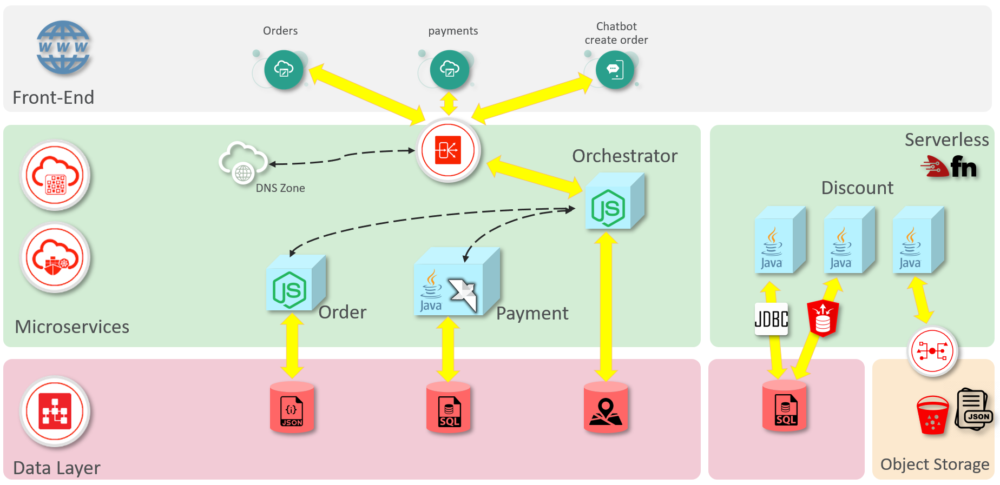

As you can see there isn't any connection or call from microservice orchestrator to the new discount campaign serverless app or serverless function. You might have connected the old serverless function to your microservice orchestrator, but the idea is that you could use the new serverless app.

To connect your microservice orchestrator to the new serverless app, you'll use [OCI api gateway service](https://docs.cloud.oracle.com/es-ww/iaas/Content/APIGateway/Concepts/apigatewayoverview.htm). Following next HOL you'll can create an API Gateway in OCI to invoke your discount serverless function from microservice orchestrator in a simple way.

If you review the orchestrator nodejs code, you can see that a direct serverless function invoke is a little tricky, because you must create an access file with your credentials, OCI tenancy, OCI comparment and so. You must read this file, create a context and invoke the serverless function with this context. All this task are simplified using an API Gateway and you can improve security, because you don't have to create text plain config files and include them in your docker image.

The Api Gateway let you more configuration options and more management improves. The idea is at the end of this HOL you have an architecture similar to that:


Lets create an OCI Api Gateway!

## OCI Policies to use API Gateway.
To use API Gateway you must create a new Security Policy in your **root compartment**. Go to OCI main menu -> Identity -> Policies

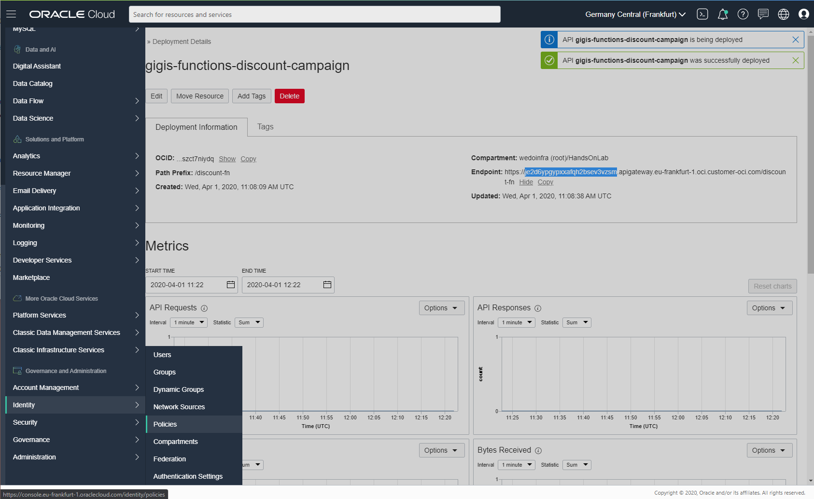

Then select your root compartment and then Create Policy.

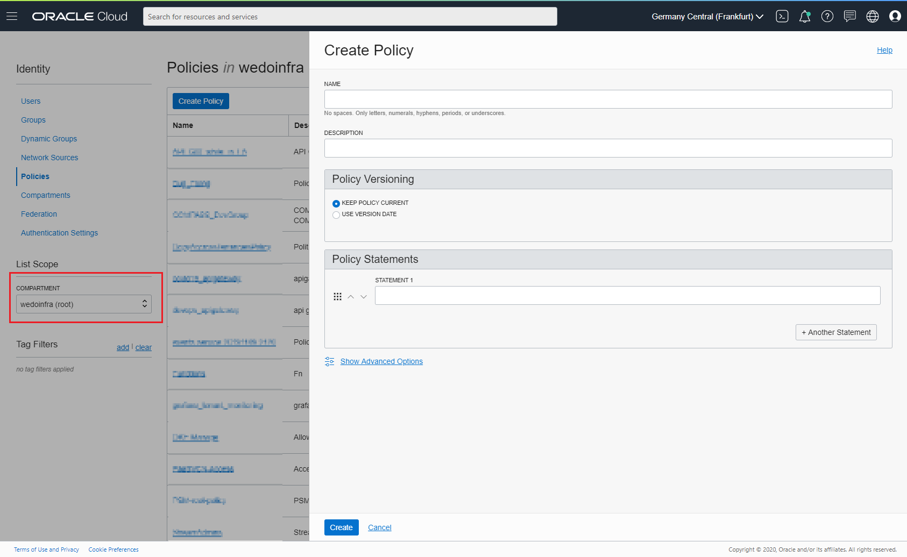

Write a descriptive name for the new Policy like [gigis-apigateway-policy]. Then a Description for the policy. Keep Policy Current, and in Statement 1 write:
```sh
Allow any-user to use functions-family in compartment <your_cmpartment_name> where ALL {request.principal.type = 'ApiGateway', request.resource.compartment.id = '<ocid1.compartment.oc1.your_hands_on_lab_compartment_id>'}
```

Then Click Create Button to create the new api gateway policy.

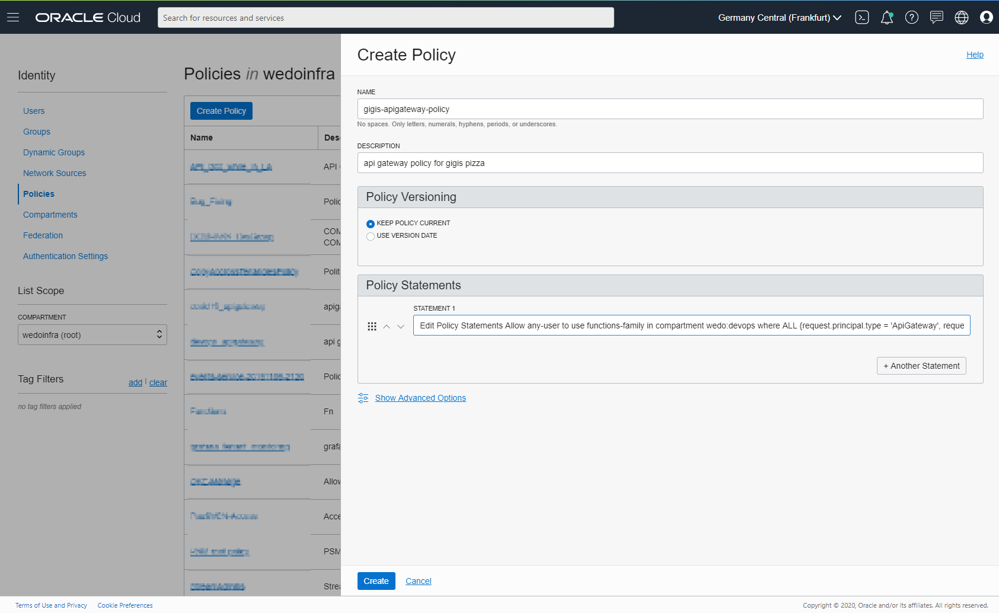

## OCI Api Gateway Creation.
Go to OCI main menu -> Developer Services -> API Gateway.

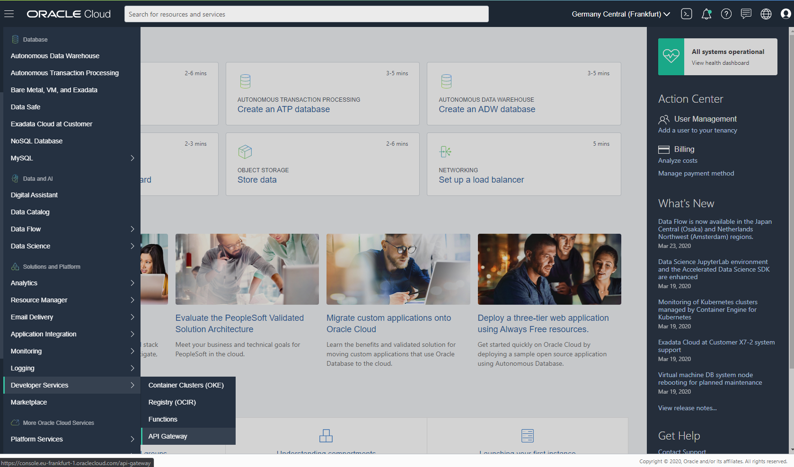

Select your compartment (you can use the last HOL-serverless compartment for example) [HandsOnLab] and Click Create Gateway Button.

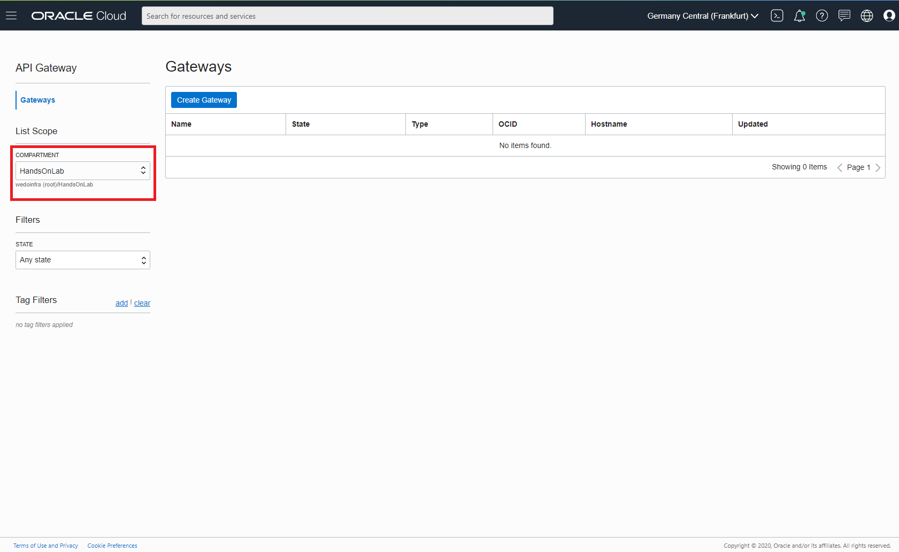

Write a descriptive name like [gigis-api-gateway] or something like that. You could create this apigateway as Private as you have the microservices and serverless functions in the same cloud provider and in the same compartment (even the same virtual network). For academical purpose you will create the apigateway as PUBLIC (to invoke the function from internet or other tenants for example). Next select a VCN and a Public Subnet (we recomend that you have created a Regional Public Subnet or add one to your VCN). Click on Create button to create your API Gateway.

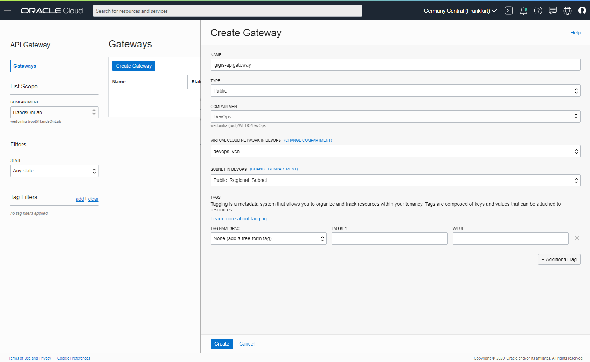

Wait several seconds to API Gateway creation (wait green Active).

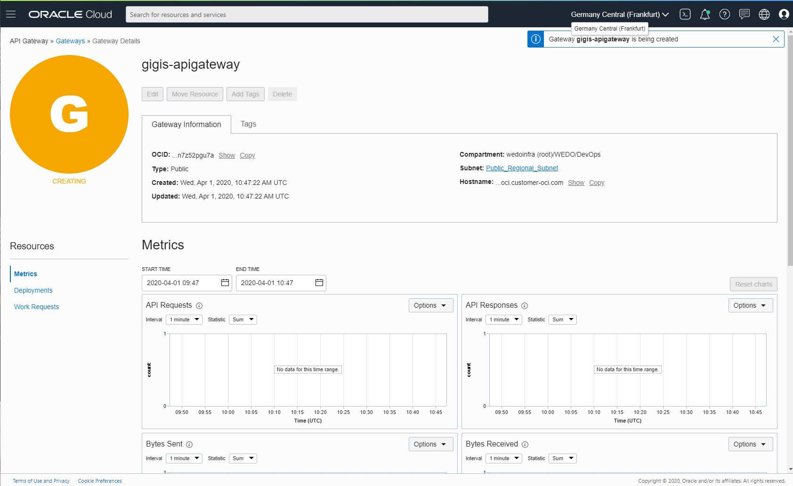

Once you have the API Gateway created you need to create Deployments. Click on Deployments link and click Create Deployment.

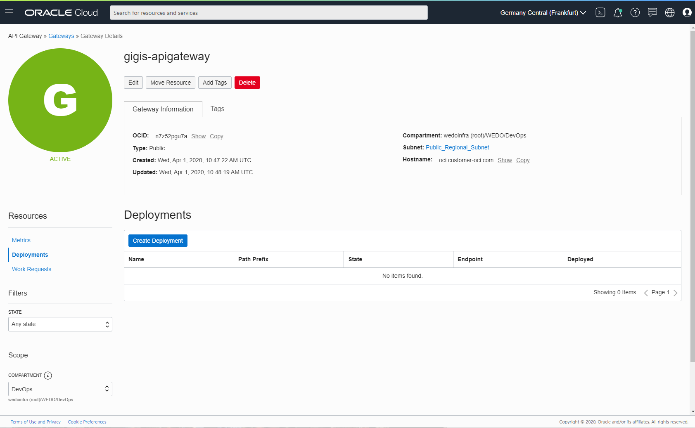

Select From Scratch to create a new API Gateway from the OCI UI. But you could create a configuration JSON file to import it and create the API Gateway from a file. Then

- Write a descriptive name like **[gigis-functions-discount-campaign]**
- Write a path to access to the new API call, like **[/discount-fn]**
- Select your compartment **[HandOnLabs]**

You could create an API Request Policies like Authentification policies, CORS or Rate Limiting. Also you could enable Access Loggin and Execution Loggin, but all these policies aren't necessary for this HOL. You could add or modify these policies later if you need to. Then Click Next to continue with the API gateway creation.

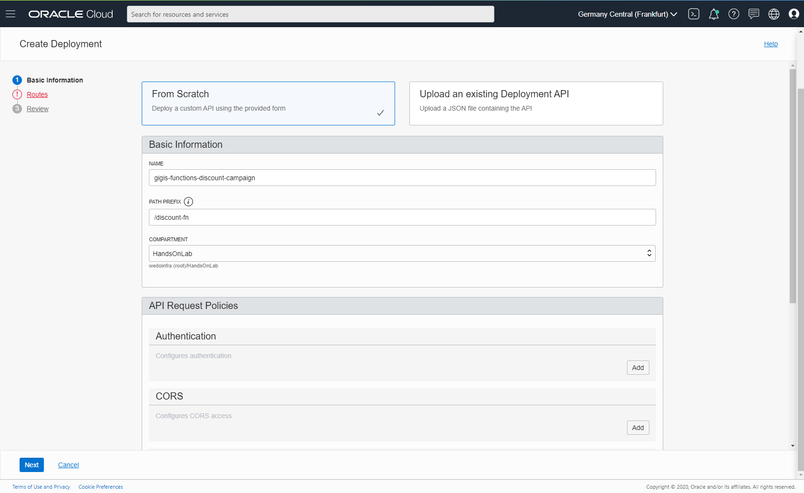

Next step is to create a Route to access to the serverless function. 

- Write a descriptive **PATH** name to your serverless function CALL like **[/discount]**
- Select GET and POST api call type **METHOD**s
- Select **Oracle Functions** TYPE
- Select your serverless app [gigis-fn]
- Select your serverless function [fnpizzadiscountcampaign] or [fnpizzadiscountcampaignpool] if you complete the optional serverless function HOL.

Then click Next to Review the Route.

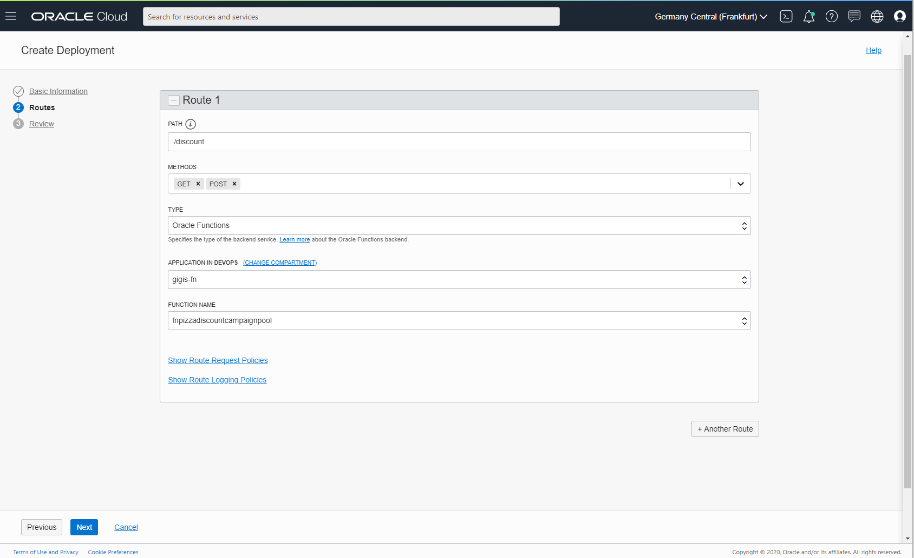

Review your Route and then Click Create button. Wait until creationg will be completed.

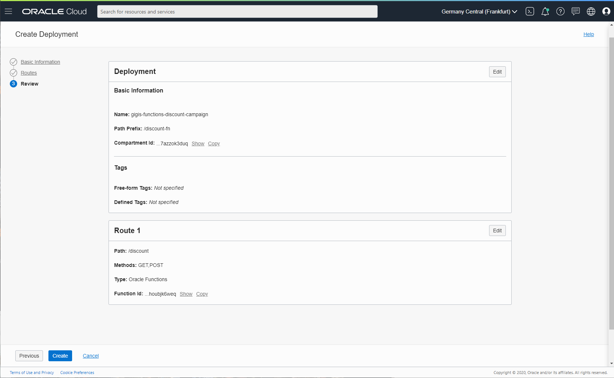

Now you must have created and Active an API Gateway Deployment.

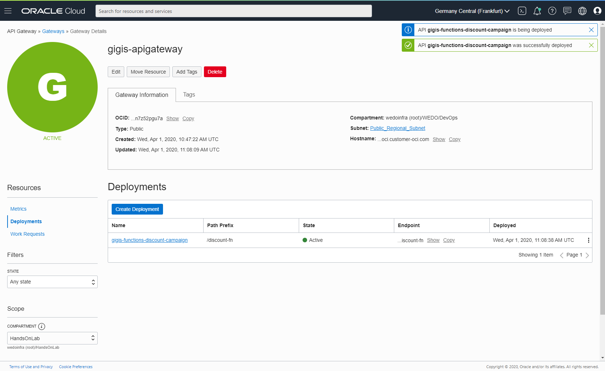

If you click on your new Deployment you could see the Deployment data including the Endpoint to do the api calls. Click in Show to review the Endpoint and Copy it to use in the next steps. You can view also the Telemetry use graphs.

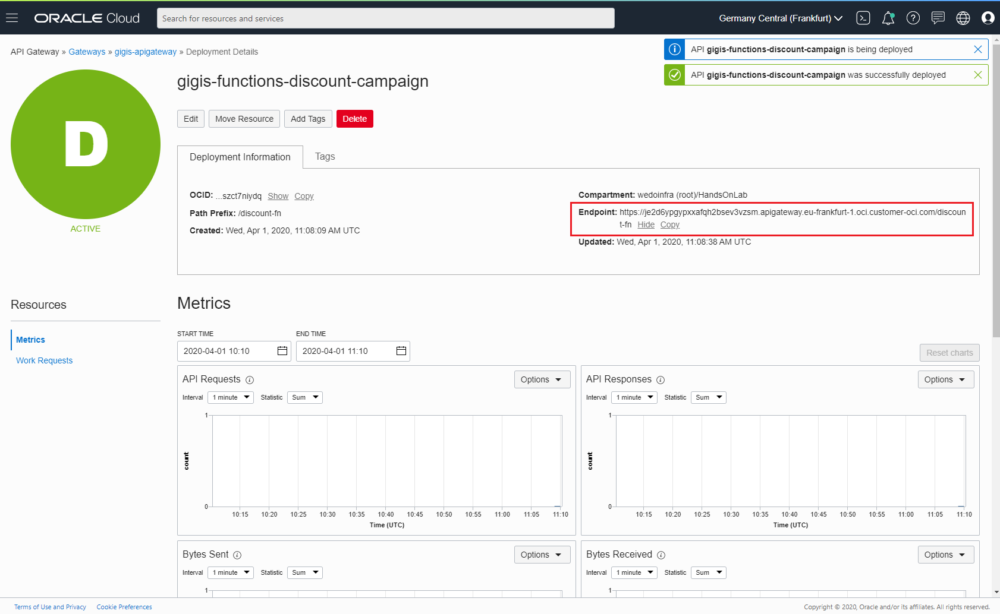

## Test your API Route.
To test your new API Gateway deployment and route, you can use your development machine to execute a cURL command like:
```sh
curl -i -k --data '{"demozone":"madrid","paymentMethod":"amex","pizzaPrice":"21"}' https://<your_endpoint_id>.apigateway.eu-frankfurt-1.oci.customer-oci.com/discount-fn/discount
```
You must receive a response like
```html
HTTP/1.1 200 OK
Date: Wed, 01 Apr 2020 12:23:41 GMT
Content-Type: text/plain
Connection: keep-alive
Content-Length: 4
Server: Oracle API Gateway
Strict-Transport-Security: max-age=31536000
X-XSS-Protection: 1; mode=block
X-Frame-Options: sameorigin
X-Content-Type-Options: nosniff
opc-request-id: /56B744A399CAB72AE35DD23ABD7294D8/E72C6994D4E16D8C3F5DDD0742375F2A

21.0
```
## Modifiying your Microservice Orchestrator
Now that you have created and tested your serverless function with your new api gateway, let's change your microservice orchestrator to send an API call to your serverless function.

To modify your microservice orchestrator, you should use an IDE program like installed in your development machine (visual studio core for example). You could get the code from your GIT repository in Developer Cloud Service (git clone command).

### Git Clone microservice orchestrator project
You can use the same develpment machine as you used in serverless HOL. This machine should have intalled an IDE software like visual studio core, jdeveloper, eclipse... for example. The recomendation is to use a linux based machine but you can use windows too. This HOL was made with a linux based machine.

Create a new directory to store your git project. [vscode-projects-oci] then [nodejs] for example.


Open Developer Cloud Service microservices project and select microservice_orchestrator in the GIT menu. Then select Clone dropdrownbox and copy https url.

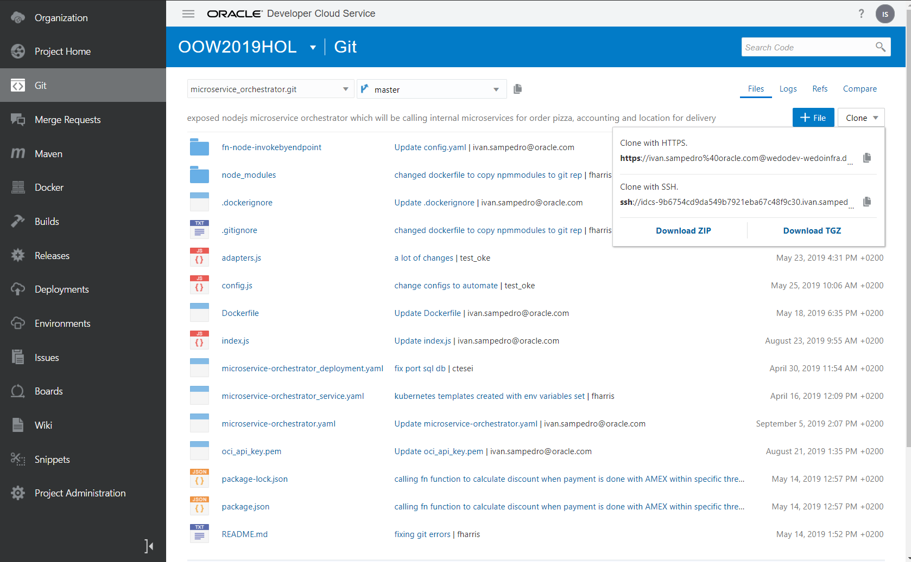

Next open your IDE software and create a git clone of the microservice orchestrator from Developer Cloud Service GIT repository that you imported in the microservices HOL. This HOL was made with visual studio core included in the [development image in OCI](https://github.com/oraclespainpresales/GigisPizzaHOL/blob/master/devmachine-marketplace.md) as you could see in ther serverless HOL.

Then ```CTRL+SHIFT+p``` to open the commands menu and select ```git clone```

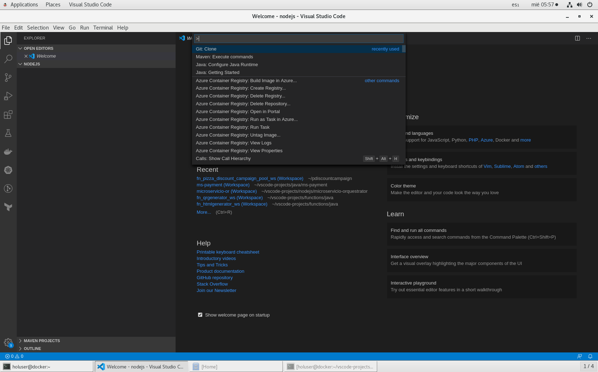

Copy the https URL cloned from DevCS and press Enter.

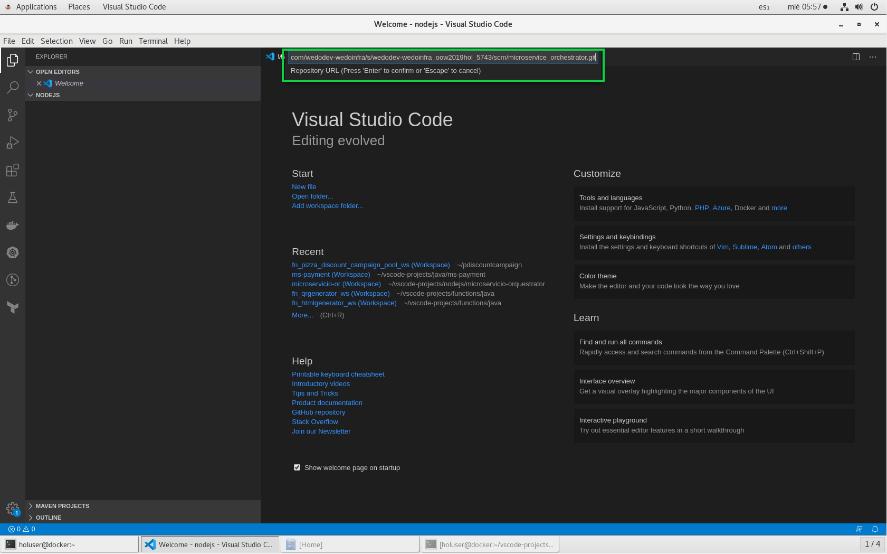

Select your recently created directory [vscode-projects-oci/nodejs] to put your local git repository and click Select Repository Location button.

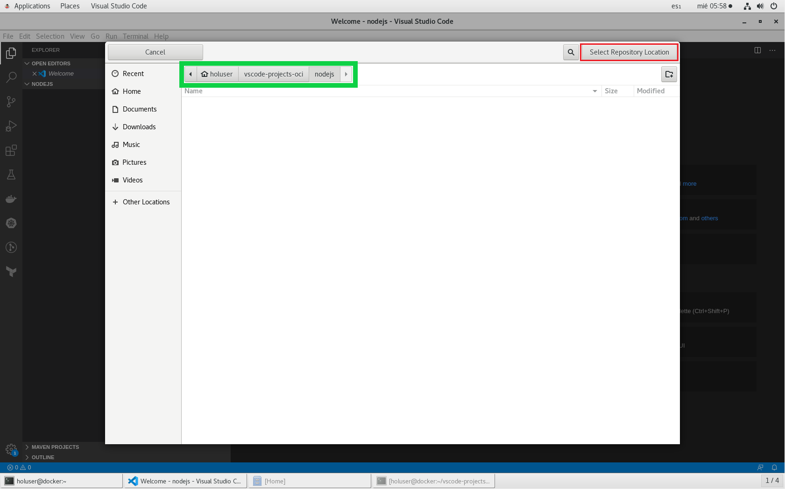

Next write your DevCS user password to access your GIT repository and press Enter. Visual Studio will create a new [.git] repository in your local directory.

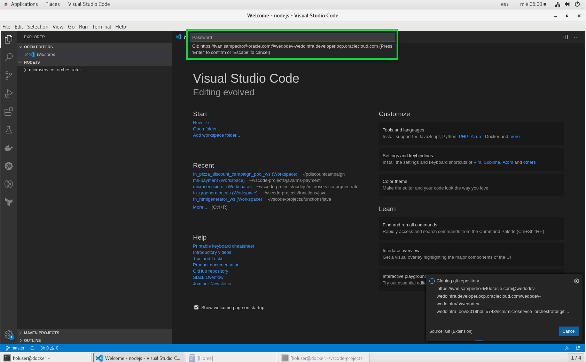

A new [microservice_orchetrator] directory will be created with the entire project inside it.

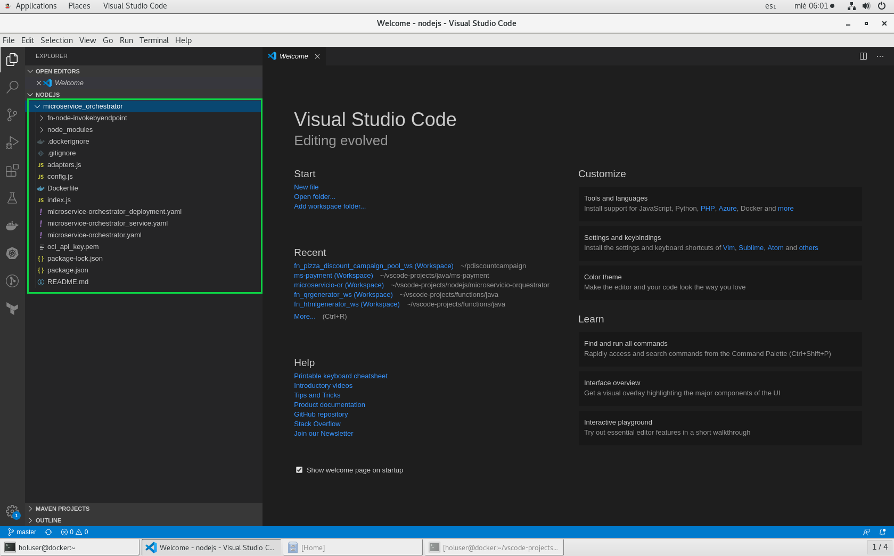

### Changing your microservice orchestrator code.
You must change your microservice orchestrator code in order to make an api call to the discount serverless function. First you must introduce a new gateway config in the config.js file, so open your oci api gateway at OCI main menu -> Developer Services -> API gateway, then select your gateway and copy the **[Hostname]** value.

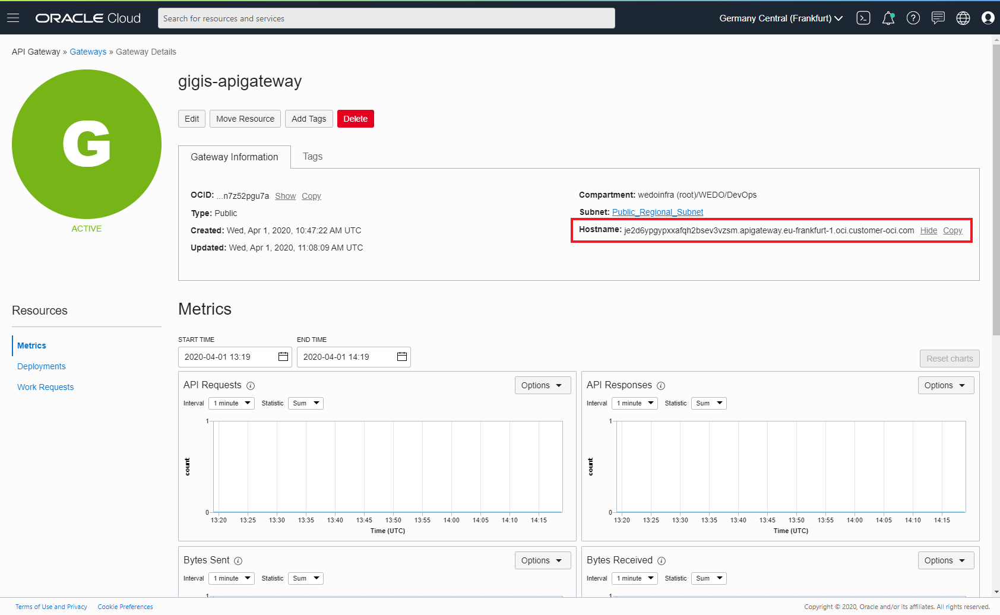

#### config.js
Next, open config.js file in your IDE and write this code after ```HOST: process.env.ORCH_HOST || 'localhost',``` line:

```javascript
    //############### JSON API GW CONFIG ####################
    jsonfncl: {
        getDiscount: {
            host: 'je2d6ypgypxxafqh2bsev3vzsm.apigateway.eu-frankfurt-1.oci.customer-oci.com',
            port: 443,
            method: 'POST',
            path: '/discount-fn/discount',
            headers: {
                'Content-Type': 'application/json'
            }
        }
    },
 ```
The host value is the copied hostname value (something like ``` 
je2d6ypgypxxafqh2bsev3vzsm.apigateway.eu-frankfurt-1.oci.customer-oci.com```) and the path value is the deployment path + route path ```/discount-fn/discount```.

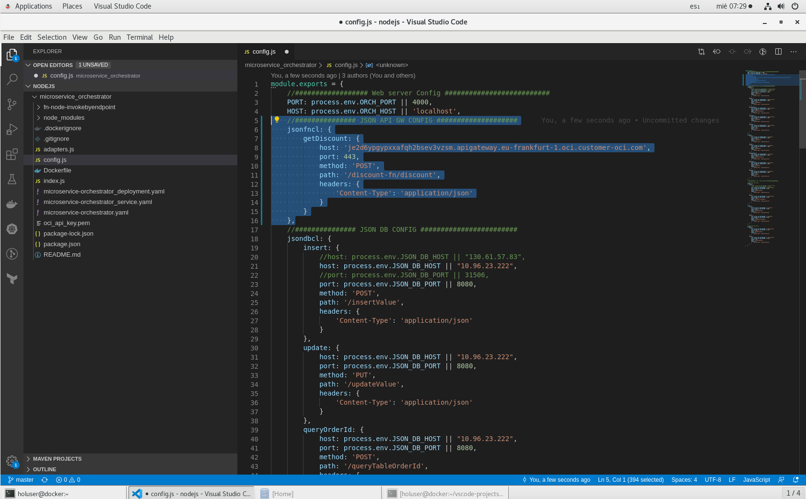

#### adapters.js
Now you must change the adapters.js file. This file contain the use method that is the code to send http request to other microservices. As the api gateway use https instead of http, you must include https requests in the use function. Copy the next [code](https://raw.githubusercontent.com/oraclespainpresales/wedo_gigispizza_ms_orchestrator/master/adapters.js) to change the original one.

```javascript
"use strict";
const http = require('http');
```
import the https request functionality for nodejs express.
```javascript
const https = require('https');
```
The config data is the information that you write in the config.js file. As you wrote in that file, the service port is 443 (https), so you can use this information to change the call type from http to https.
```javascript
function use(config, data) {
    var type = "http"
 
    console.log("USE#config ", config);
    console.log("USE#port ", config.port);
    if (config.port == "443"){
        type = "https"
    }
    console.log("USE#type ", type);
 ```
 Then you could replicate the http code but instead of use **http.request** you must use **https.request**.
 ```javascript
    let result = new Promise(function (resolve, reject) {
        let body = data
        // request option
        let options = config
        // http or https request object
        if (type == "http"){
            let req = http.request(options, function (res) {
                let result = '';
 
                res.on('data', function (chunk) {
                    result += chunk;
                });
 
                res.on('end', function () {
                    var response = JSON.parse(result);
                    resolve(response)
                });
 
                res.on('error', function (err) {
                    console.log("Error calling: " + config.path);
                    reject(err)
                })
            });
 
            req.on('error', function (err) {
                console.log("Error calling: " + config.path);
                reject(err)
            });
 
            //send request
            console.log("USE#INFO http Method: ", options.method);
            if (options.method != "GET"){
                console.log("INFO body: ", JSON.stringify(body));
                req.write(JSON.stringify(body));
            }
            req.end();
        }
        else{
            let req = https.request(options, function (res) {
                let result = '';
 
                res.on('data', function (chunk) {
                    result += chunk;
                });
 
                res.on('end', function () {
                    var response = JSON.parse(result);
                    resolve(response)
                });
 
                res.on('error', function (err) {
                    console.log("Error calling: " + config.path);
                    reject(err)
                })
            });
 
            req.on('error', function (err) {
                console.log("Error calling: " + config.path);
                reject(err)
            });
 
            //send request
            console.log("USE#INFO https Method: ", options.method);
            if (options.method != "GET"){
                console.log("INFO body: ", body);
                req.write(body);
            }
            req.end();
        }
    });
 
    return result
}
 
module.exports.use = use;
```

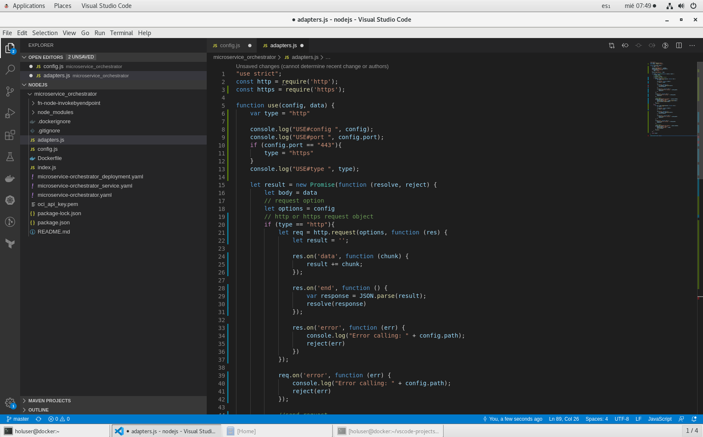

#### index.js
This is the main file in the microservice orchestrator. In this file you can see the invoke code to a serverless function, but you will change that code to use the api gateway call instead of create a direct invoke to the serverless function.

The invoke code is in the ```/createOrder``` post call. You must change the entire function with the new code.

```javascript
app.post('/createOrder', async (req, res) => {
    try {
        //Payload to call at "config.jsondb.insert"
        let order   = req.body.order
        let payment = req.body.payment
                
        //console.log(req.body);
        console.log("ORDER-BODY",order);
        console.log("PAYMENT-BODY",payment);

        let paymentMethod = req.body.payment.paymentMethod;
        let totalPaid     = req.body.payment.totalPaid;

        //Applying a discount calculated with a serverless function
        //if (paymentMethod == "AMEX") {  
        console.log("Searching for a discount");      
            
        console.log("Total to pay before discount applied (1***):" + totalPaid + "$");
        var totalpaidInput = '{"demozone":"' + demozone + '","paymentMethod":"' + paymentMethod + '","pizzaPrice":"' + totalPaid + '"}'
        console.log("Input Object:: " + totalpaidInput);    
        adapters.use(config.jsonfncl.getDiscount, totalpaidInput).then((response) => {
            console.log("functionResponse :" + response)
            // Change the valueof payment.totalPaid
            payment.totalPaid = response.toString();
            console.log("Total to pay after discount applied (1***):" + payment.totalPaid + "$");
            insertData(order,payment,res); 
        }).catch((err) => {
            console.error("Error: createOrder-> ", err);
            res.send({"error":err.toString()});
        })        
    }
    catch (err){
        console.error("Error: createOrder-> ", err);
        res.send({"error":err.toString()});
    }
});
```
The new app.post creteOrder function includes next piece of code. You can see the use method (from adapters.js) to invoke the api gateway call that is configured in the config.js (from JSON **config.jsonfncl.getDiscount**)
 ```javascript
adapters.use(config.jsonfncl.getDiscount, totalpaidInput).then((response) => {
    console.log("functionResponse :" + response)
    // Change the valueof payment.totalPaid
    payment.totalPaid = response.toString();
    console.log("Total to pay after discount applied (1***):" + payment.totalPaid + "$");
    insertData(order,payment,res); 
}).catch((err) => {
    console.error("Error: createOrder-> ", err);
    res.send({"error":err.toString()});
})  
```

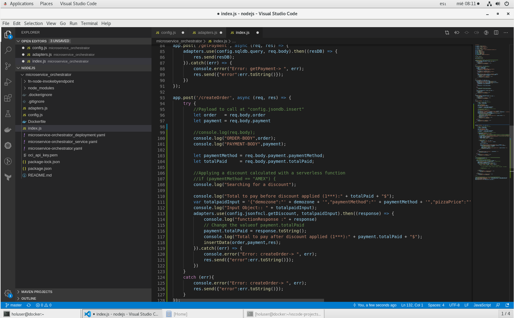

### Test the microservice orchestrator
Once you have finished the change of the new code, you must update your DevCS Git repository. Click File Save All in your IDE. 

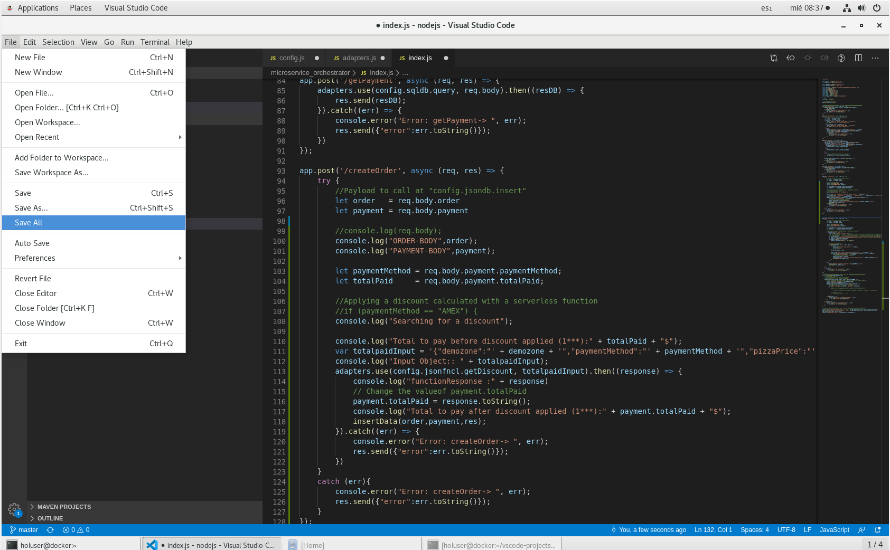

Then push the new changes to your Git repository. Click in the SCM icon.

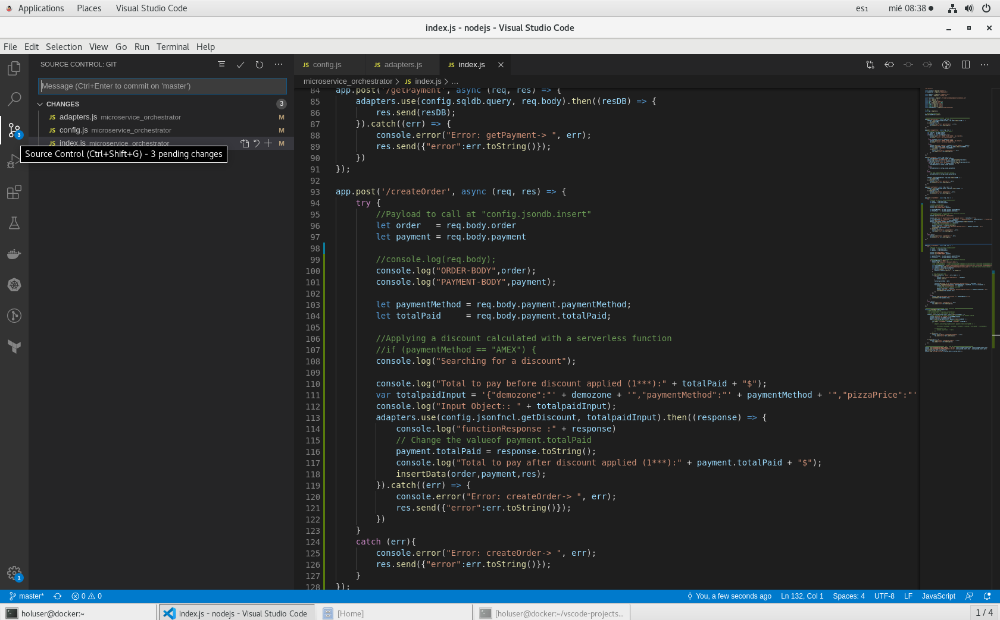

Next click in the commit icon at the top of the IDE Source Control frame.

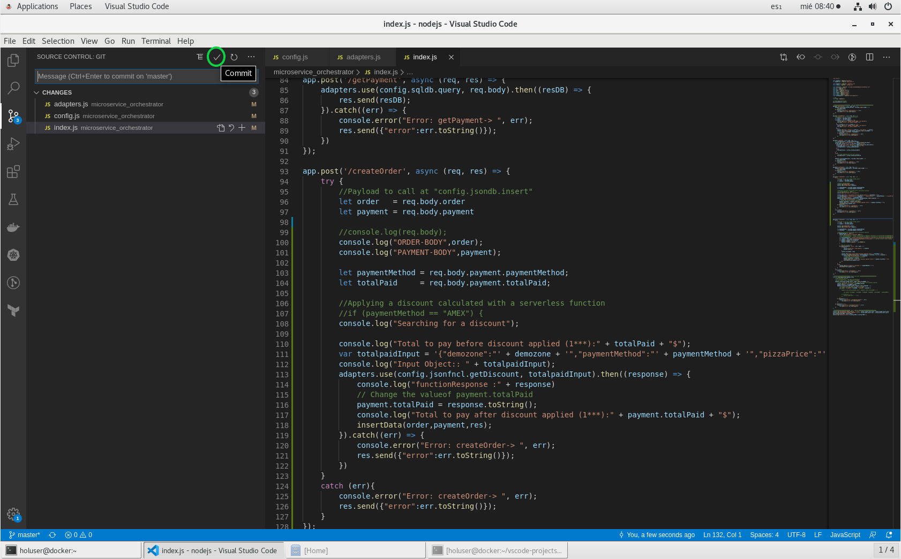

Write a comment for this commit and press Enter.

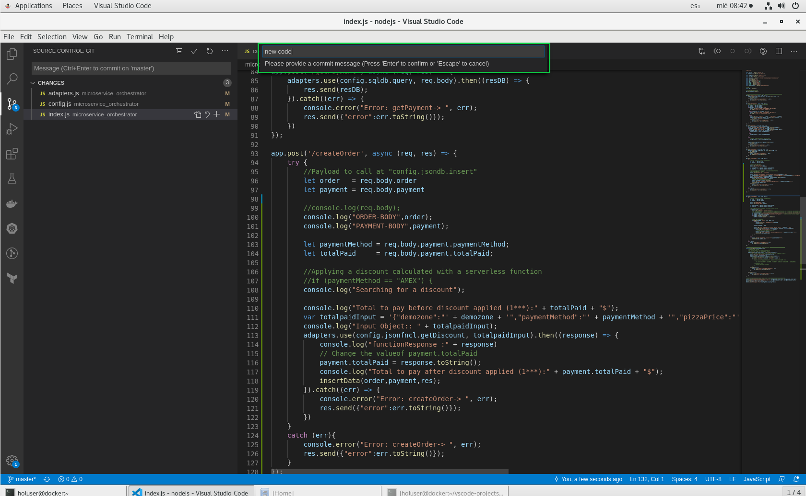

Push your code to the Git repository and introduce your DevCS password.

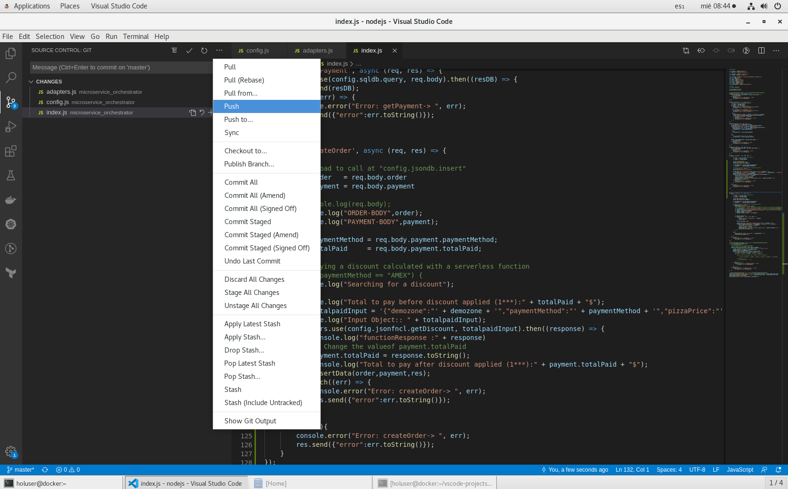

After push completion, DevCS starts the microservice orchestrator pipeline to upgrade your code in your OKE cluster. Wait several minutes to complete that deployment to test the new functionality.

You can review the functions telemetry and papertrail or loggin service functions logs, after a pizza order execution in the chatbot for example.


