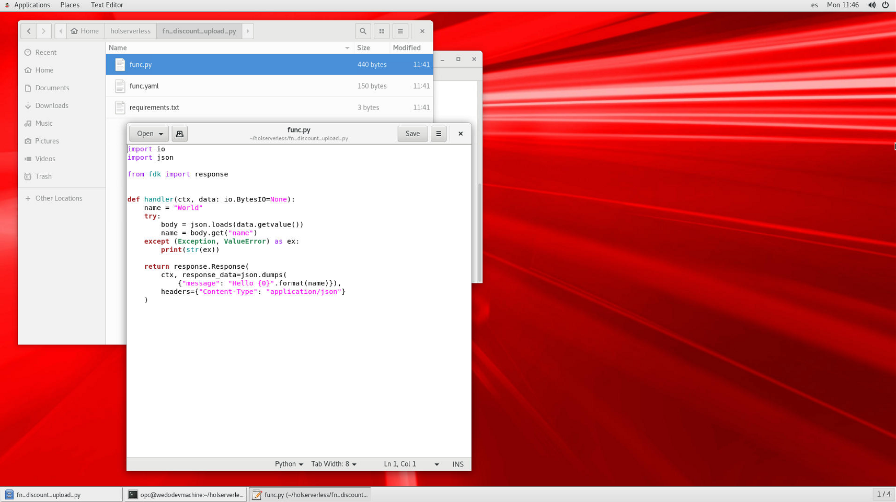
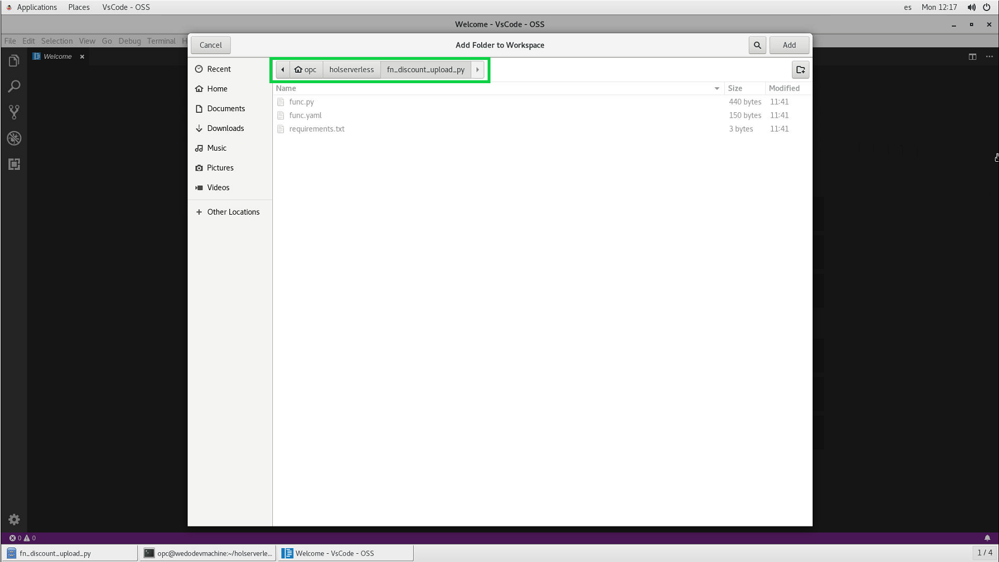
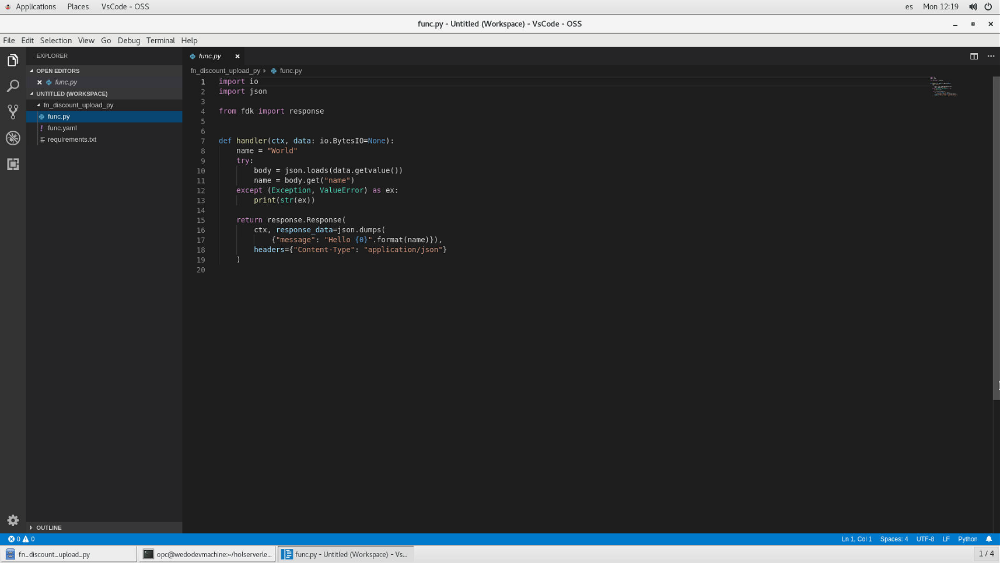
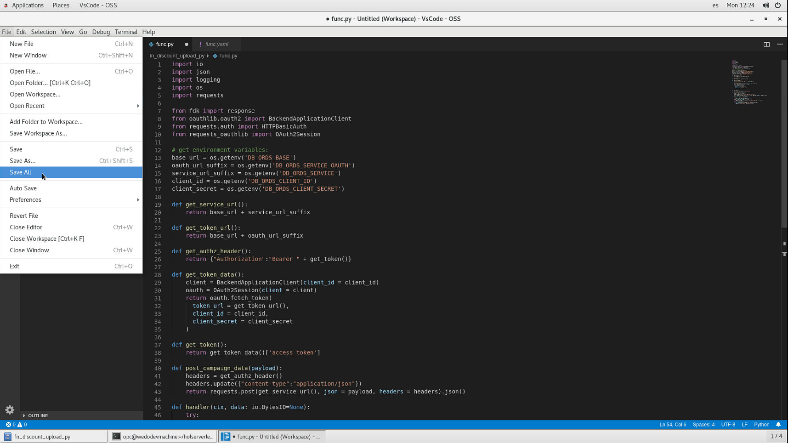
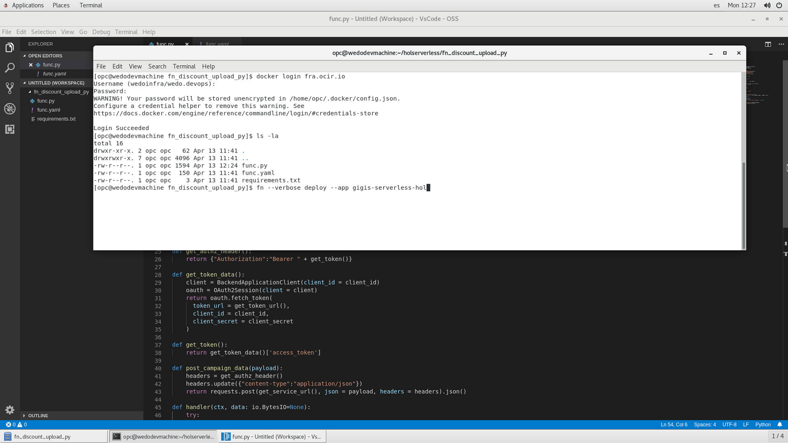
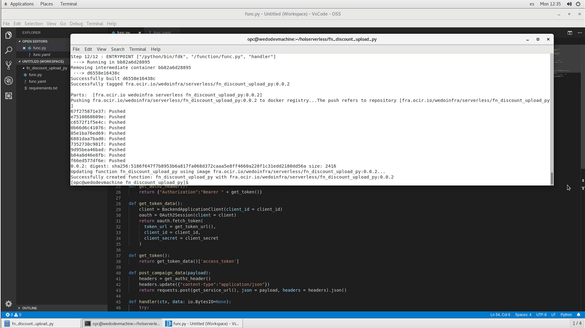
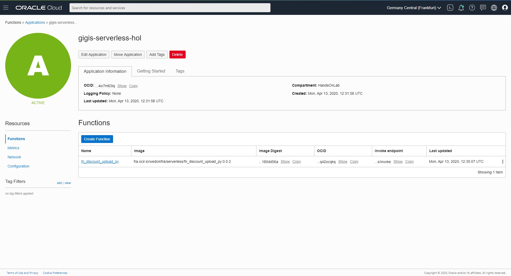

# Function fn discount upload in Python
This serverless function will upload discount campaign received in json format to **CAMPAIGN table** in the **ATP DB** via **ORDS** (*Oracle REST Data Services*). This function will be invoked by **fn_discount_cloud_events** that is the function that catch cloud events, access campaign.json file in a Object Storage bucket and will send each campaign inside that json file, to this **[fn_discount_upload_py]** serverless function.

Table of Contents:
1. [fn discount upload IDE preparation](#fn-discount-upload-ide-preparation)
2. [fn discount upload python code](#fn-discount-upload-python-code)
3. [Deploy fn discount upload function](#deploy-fn-discount-upload-function)
4. [Code recap (OPTIONAL)](#code-recap-optional)
5. [Continue the HOL](#continue-the-hol)

To create your optional serverless python function you must write next command line:

```sh
fn init --runtime python fn_discount_upload_py
```


Verify that your new function has 2 files (func.yaml and func.yaml).

```sh 
cd fn_discount_upload_py

ls -la
```


The serverless function should be created at ```func.py``` and you can review the example code with and your IDE or text editor. This file will be change in the next section.



## fn discount upload IDE preparation
You could deploy this new serverless function in your FaaS environment, but the idea is to change the example code by the real function code. You can use a text editor or you favourite IDE software. In this lab we used Visual Studio Code (from the developer machine imagen in OCI marketplace), so all images was captured with that IDE, but you can use what you want.

Open Visual Studio Code (Applications -> Accessories in the development VM) or your favourite IDE 


Select **add workspace folder ...** in the Start Menu.


Click in HOME directory and next select the appropiate path to your function project directory [opc/holserverless/fn_discount_upload_py]. Then click Add button to create a workspace from this directory in Visual Studio Core.



A new project will be available as workspace in the IDE


You can click in **func.py** to review your serverless function code. Same for **func.yaml** file.



### fn discount upload python code
The function code is in the next github [repository](https://github.com/oraclespainpresales/GigisPizzaHOL/tree/master/serverless/polyglot/python/pizza_discount_upload). You can open it in other web brower tab (```CRTL + mouse click```, to review the project.

You can access java code to copy and paste it in your develpment machine IDE project. You could clone this github repository if you want, instead of copy and paste the different files. You can learn how to clone the git repo in this [section](clone-git project to IDE).

For educational purposes you will change the code created before with ```fn init``` command instead of clone the git repo, but you could use that method to replicate the entire function project.

You can copy the pythin function code creating a new file with the function name, in the fn directory or overwriting the existing code inside the **[func.java]** function and next rename it (F2 key or right mouse button and Rename). We show you both methods in the next sections, please choose one of them.

#### Overwriting func.py
You can overwrite the func.py code with the new func.py Function code.

Select the raw [python function code](https://raw.githubusercontent.com/oraclespainpresales/GigisPizzaHOL/master/serverless/polyglot/python/pizza_discount_upload/func.py) from the repository and paste it overwriting the func.py Function.


After that, click in File -> Save All in your IDE to save all changes.



## Deploy fn discount upload function
To deploy your serverless function please follow next steps, your function will be created in OCI Functions inside your serverles app [gigis-serverless-hol]. 

Open a terminal in your development machine and execute:
```sh
cd $HOME/holserverless/fn_discount_upload_py
```
Then you must login in OCIR registry (remember use your OCIR [region](https://docs.cloud.oracle.com/en-us/iaas/Content/Registry/Concepts/registryprerequisites.htm#Availab)) with ```docker login``` command. Introduce your OCI user like ```<Object Storage namespace>/<user>``` when docker login ask you about username and your previously created **OCI Authtoken** as password.
```sh
docker login <your_region>.ocir.io
```
You must execute next command with ```--verbose``` option to get all the information about the deploy process.
```sh
fn --verbose deploy --app gigis-serverless-hol
```


Wait to docker image creation and function deploy in OCI serverless app finish.



Check that your new function is created in your serverless app [gigis-serverless-hol] at Developer Services -> Functions menu.



Click in the function name **fn_discount_upload_py**, click in show OCID and show Endpoint and note their ids as you will need them to create the environment variables in **fn_discount_cloud_events** function section in the next function creation.

Now you can continue with the creation of the next [fn_discount_cloud_events](https://github.com/oraclespainpresales/GigisPizzaHOL/blob/master/fn_pizza_discount_cloud_events.md) serverless function or optionally review the code to know more about this serverless function.

## Code recap (OPTIONAL)
You copy the function code and made several changes in the configuration files like func.yaml and func.ymal. Now we'll explain this changes:

### func.py
Prerequisites imports:
```python
from fdk import response
from oauthlib.oauth2 import BackendApplicationClient
from requests.auth import HTTPBasicAuth
from requests_oauthlib import OAuth2Session
```
The python libs that you need to execute your python functiona are:
- fdk
- requests
- oauthlib
- requests-oauthlib

Next the code and functions to recoger the environmental variables from FaaS service and get the ATP service and token URLs.
The get token function will get the token to initialize the ORDS connection.
```python
# get environment variables:
base_url = os.getenv('DB_ORDS_BASE')
oauth_url_suffix = os.getenv('DB_ORDS_SERVICE_OAUTH')
service_url_suffix = os.getenv('DB_ORDS_SERVICE')
client_id = os.getenv('DB_ORDS_CLIENT_ID')
client_secret = os.getenv('DB_ORDS_CLIENT_SECRET')

def get_service_url():
    return base_url + service_url_suffix

def get_token_url():
    return base_url + oauth_url_suffix

def get_authz_header():
    return {"Authorization":"Bearer " + get_token()}

def get_token_data():
    client = BackendApplicationClient(client_id = client_id)
    oauth = OAuth2Session(client = client)
    return oauth.fetch_token(
      token_url = get_token_url(),
      client_id = client_id,
      client_secret = client_secret
    )

def get_token():
    return get_token_data()['access_token']
```
The post campaign function will create response headers of "application/json" type.
And the handler funtion is the piece of code that FaaS will execute when you invoke upload serverless funcion. It takes the json data from data variable and send them to the ATP via ORDS.
```python
def post_campaign_data(payload):
    headers = get_authz_header()
    headers.update({"content-type":"application/json"})
    return requests.post(get_service_url(), json = payload, headers = headers).json()

def handler(ctx, data: io.BytesIO=None):
    try:
        body = json.loads(data.getvalue())
    except (Exception, ValueError) as ex:
        logging.getLogger().info('error parsing json payload: ' + str(ex))

    return response.Response(
        ctx, response_data=json.dumps(post_campaign_data(body)),
        headers={"Content-Type": "application/json"}
```

# Continue the HOL

* [fn_discount_cloud_events](https://github.com/oraclespainpresales/GigisPizzaHOL/blob/master/serverless/fn_pizza_discount_cloud_events.md)
