[](https://www.oracle.com/code-one/)

# Gigi's Discount Campaigns - Serverless HOL with Fast forward
This HOL is based in a Demo developed by Spain Presales Tech Team as part of an innovation initiative to approach Oracle Cloud Solutions by providing practical examples that could be “touched” and easily understood.

Demo is known as Gigi’s Pizza. This Use Case is focused in serverless (fn) and Autonomous DataBase. In Gigi's Pizza demo we have three microservices coded in different languages like nodejs and of course Java (Helidon framework). This three microservices are part of a delivery pizza app, one microservice controls the orders, other one controls the pizza delivery and the last one controls the accounting. 

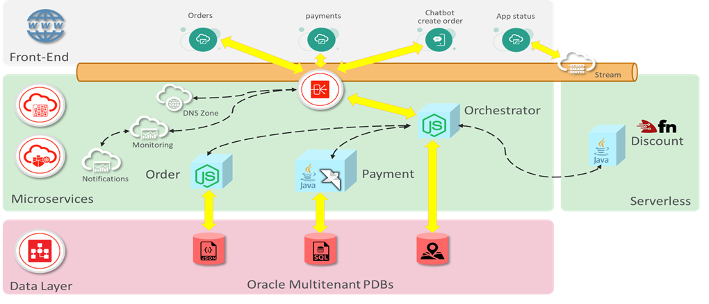

In the first demo version, we had one serverless function that got you a pizza price discount acording to a basic bussiness rule, if the pizza price was between 10$ - 15$ you received discount of 1%, if the pizza price was between 15$ - 19$ you received 2% and if the pizza price was over 19$ you received a 2% discount. It was very interesting to show a basic serverless function and graalvm compiler, but the idea is to show you more about serverless. Now we show you a more elaborated serverless app and you can touch it and modify the code as your needs.


This serverless Hands On Lab includes:

* Terraform deployment for:
  * Oracle IaaS main elements like Compartments, Policies and VCN.
  * Oracle ATP - Autonomous Transaction Processing - Autonomous Database as main repository.    
  * Oracle Cloud Infrastructure - Object Storage to upload json files with discount campaigns.
* CloudEvents to trigger this json files and upload them to the ATP.
* Oracle managed Functions (serverless fn based) to upload data, get data and send it to microservices.
* Oracle ORDS (REST services) access to ATP using serverless Functions.
* Oracle JDBC access to ATP using serverless Functions.

## In this Hands on Lab

All HOL was written in English and all the screenshots are in English Language. We recomend you that select English as your default language in Oracle Cloud. Select the Earth Icon at the top right (near your profile icon) and change the language to English.

In this HOL you will create a serverless app for discount campaigns. 
You will:

- Import a Terraform deployment in Oracle Cloud Shell and execute plan and apply to create IaaS in OCI.
- This Terraform deployment will:
    - Create and Configure a **OCI Compartment** that will contain the whole project.
    - Create and Configure a **VCN Virtual Cloud Network** to connect the serverless functions.
    - Create an **OCI Object Storage** to upload the json files.
    - Create and Configure an **ATP (Autonomous Database)** to store the discount campaign.
- Create a **CloudEvents** trigger to upload automatically the campaigns to ATP.
- Create a discount campaign **json file** like this:

```yaml
{
  "campaigns": [
    {
    "demozone": 'MADRID',
    "paymentmethod": "VISA",
    "date_bgn": "2020-01-21T00:00:00Z",
    "date_end": "2020-01-22T00:00:00Z",
    "min_amount": "15",
    "discount": "10"
    },
    {
    "demozone": "MADRID",
    "paymentmethod": "AMEX",
    "date_bgn": "2020-01-21T00:00:00Z",
    "date_end": "2020-01-22T00:00:00Z",
    "min_amount": "7",
    "discount": "10"
    }
  ]
}
```

- Create **2 serverless Functions** to capture the event, process the file and upload the data to ATP PDB.
- Create **1 serverless Function** to get the discount amount for a pizza order

If you attend our previous HOL about Gigi's pizza, you had created a Cloud Account and DevCS instance, but if you don't have any Oracle Cloud Account you could create one, following the first step of the LAB. 

(OPTIONAL) All the code project could be stored in a project and GIT repos in Developer Cloud Service. if you attended our previous LAB about microservices (gigi's pizza) before, you should have a DevCS instance with the Gigi's project copied on it. You can use that DevCS instance and the same Gigi's project to do this optional part.

## Table of contents

1. [Setting up an Oracle Cloud Account](#setting-up-an-oracle-cloud-account)
2. [Getting key config data from Oracle Cloud Tenancy](#getting-key-config-data-from-oracle-cloud-tenancy)
3. [How to get OCI tenancy config data](#how-to-get-oci-tenancy-config-data)
4. [Launch Terraform deployment from Oracle Cloud Shell](#launch-terraform-deployment-from-oracle-cloud-shell)
5. [Review OCI Components](#review-oci-components)  
   - 5.1. [VCN - Virtual Cloud Network Review](#vcn---virtual-cloud-network-review)
   - 5.2. [Virtual Developer cloud Machine](#virtual-developer-cloud-machine)
   - 5.3. [Object Storage Review](#object-storage-review)
   - 5.4. [ATP - Autonomous Database Review](#atp---autonomous-database-review)
   	  - 5.4.1. [Get ATP Wallet File](#get-atp-wallet-file)
	  - 5.4.2. [ATP-Service Console](#atp-service-console)
   - 5.5. [Oracle FaaS Serverless Application Review](#oracle-faas-serverless-application-review)
	  - 5.5.1. [Function Environment Variables](#function-environment-variables-review)
6. [Functions Logging](#functions-logging)  
7. [Serverless Functions Coding](#serverless-functions-coding)
   - 7.1. [Creating the Serverless Functions](#creating-the-serverless-functions)
   	  - 7.1.1. [Fn Context](#fn-context)
	  - 7.1.2. [Create Fn Serverless Functions](#create-fn-serverless-functions)
8. [Event Service - Cloud Event Creation](https://github.com/oraclespainpresales/GigisPizzaHOL/blob/master/serverless/event-service.md)
9. [Execute Serverless App](#function-testing)
[<span class="underline">:grey_question: OPTIONAL - FaaS and Developer Cloud Service</span>](https://github.com/oraclespainpresales/GigisPizzaHOL/blob/master/serverless/devcs2fn.md) 

## **Setting up an Oracle Cloud Account**

As an attendee of this lab you have been provided with access to a free trial account part of Free Oracle Cloud Program with 500$ / 30 days trial. This trial is associated with the email address you used to register to the event.

Go to [<span class="underline">http://cloud.oracle.com</span>](http://cloud.oracle.com) and click in the “Try for Free” button in the top right:


Then enter your email address and select your Country/Territory:

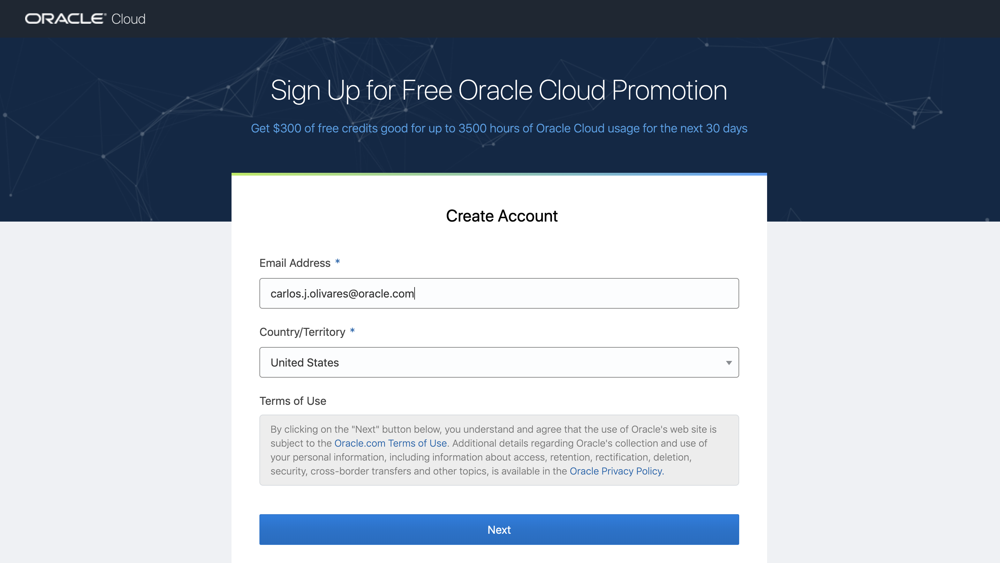

The system will detect that your email address has been whitelisted as Oracle attendee and you will be offered a free trial with no need to use a credit card or sms. Trial offered is for 500$ for 30 days.


Fill in required fields. For account type, select “Personal Use”. Select a name for your trial tenancy, a region and the rest of details:


Then enter a password required to authenticate in your tenancy when provisioned. Remember password has to be longer than 12 character and including at least an upper character and a special character:

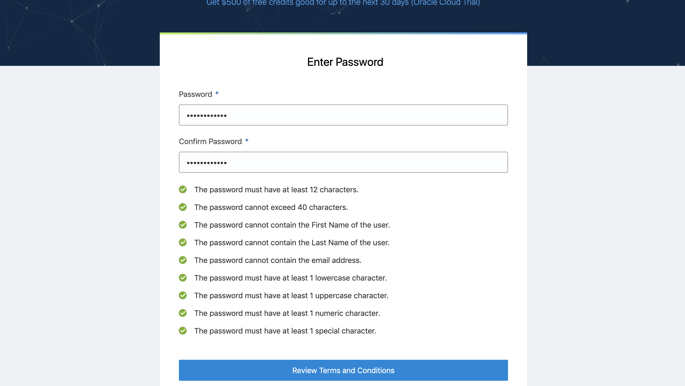

Accept the Terms and Conditions:

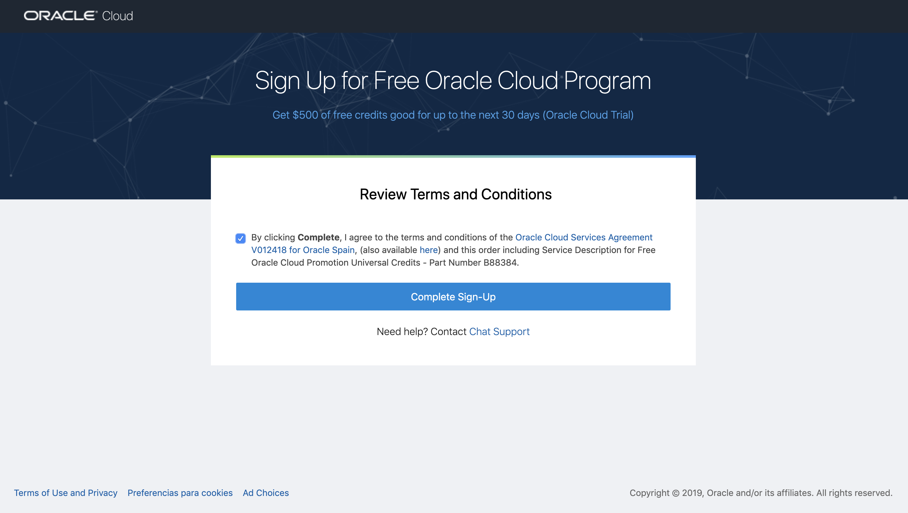

And you will be redirected to the initial page or Oracle Cloud Infrastructure to authenticate for the first time in your tenancy:


Enter your user and password just created:


And you will be directed to initial Oracle Cloud Infrastructure Dashboard (referred from now on as OCI Dashboard):


## **Getting key config data from Oracle Cloud Tenancy**
Let’s gather some key info about your OCI tenancy before launch the Terraform deployment. We recommend you to create a txt file where you store this basic info you will be required to use during this lab:

  - Tenancy OCID
  - User OCID
  
## How to get OCI tenancy config data
In Oracle Cloud Infrastructure interface menu, go to Administration-\>Tenancy Details:

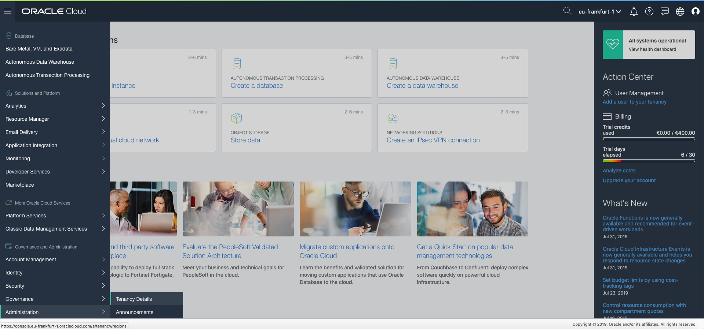

In Tenancy information area, select copy button so that you copy the OCID for tenancy and don’t forget to make a note in a txt file.

Also you can copy the **Object Storage Namespace** under the Object Storage Setting area and don’t forget to make a note in a text file. You can get this information too, at the end of the Terraform deployment apply (as terraform output).

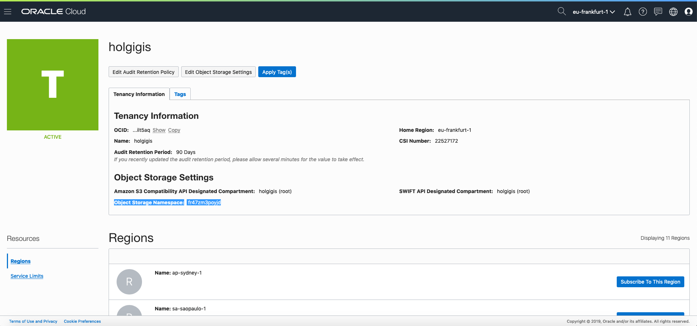

Now go to Menu option Identity-\>Users:


In Users area, find your user and click in three dot icon to show you a litle option menu with **Copy OCID** option. Select it and note your OCID in a text file. Also you could click in your user and you could copy your OCID from your user data menu.

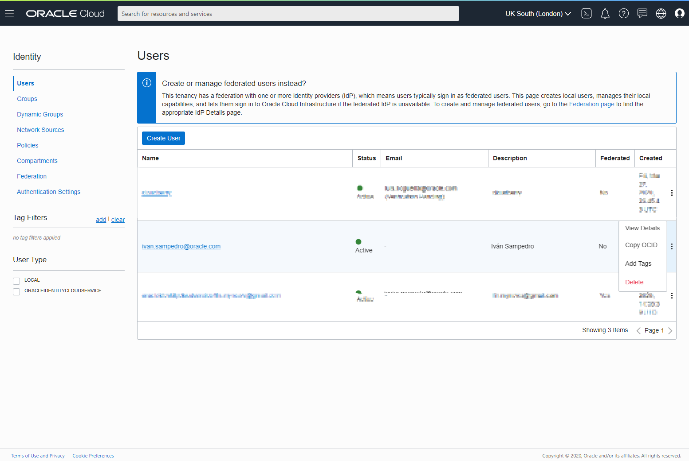

This concludes the list of OCI tenancy parameters you will require to run next sections.

## Launch Terraform deployment from Oracle Cloud Shell.
This Hands on Labs will use a Terraform Deployment project to accelerate the IaaS creation process. But you can [follow the same lab creating by hand all the OCI components](https://github.com/oraclespainpresales/GigisPizzaHOL/blob/master/serverless/gigis-serverless-HOL.md).

To execute the terraform deployment and other scripts you will use OCI Cloud Shell. Even you could test your serverless functions with Cloud shell, but what is Cloud Shell? Oracle Cloud Infrastructure Cloud (OCI) Shell is a web browser-based terminal accessible from the Oracle Cloud Console. Cloud Shell is free to use (within monthly tenancy limits), and provides access to a Linux shell. For more information please refer to the [cloud shell documentation](https://docs.cloud.oracle.com/en-us/iaas/Content/API/Concepts/cloudshellintro.htm).

To open cloud shell please click in the **Cloud Shell icon** at the top right of OCI web UI. Cloud Shell depends on you OCI region as you could read in the cloud shell documentation.


Trial accounts only have 1 region, but if you are using your own paid oracle cloud tenancy be aware of your region before launch cloud shell.

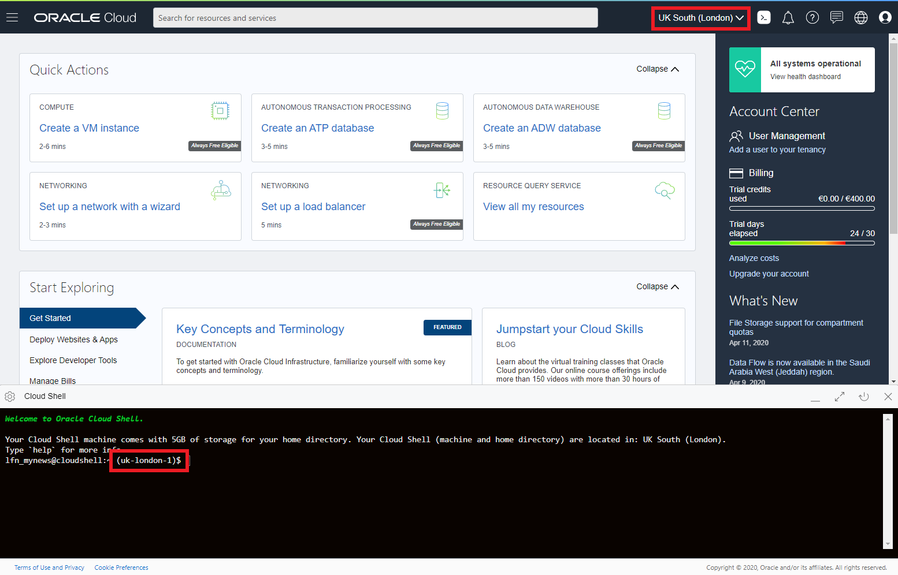

Once your cloud shell is launched, you must create a new working directory, please write a descriptive name like **[terraform-scripts]** or something like that.

```sh
mkdir terraform-scripts
cd terraform-scripts
```

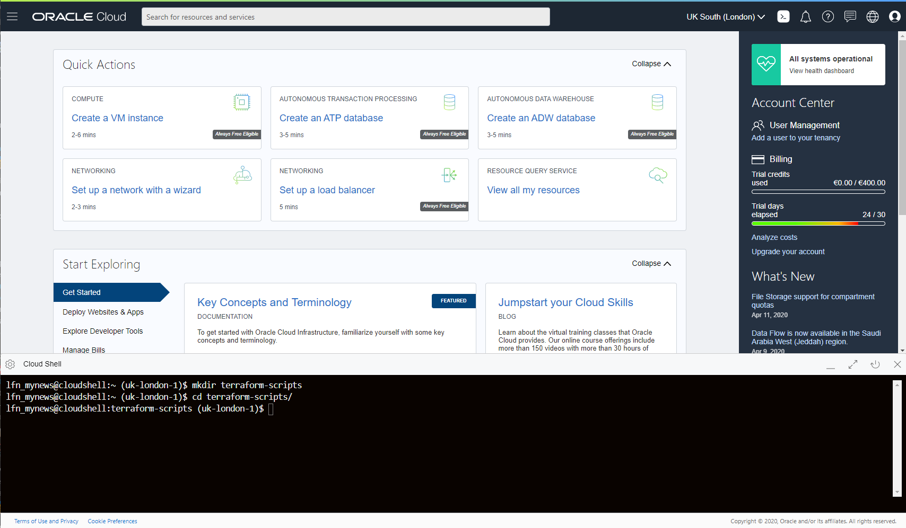

Now you must import the terraform deployment with **wget** in your cloud shell session. The imported file is a zip file, so after downloading it, you must decompress it with **unzip**. 

> #### Note: 
> *For clipboard operations, Windows users can use Ctrl-C or Ctrl-Insert to copy, and Shift-Insert or Ctrl-V to paste. For Mac OS users, use Cmd-C to copy and Cmd-V to paste*.

```sh
wget https://objectstorage.eu-frankfurt-1.oraclecloud.com/p/AHdczq0U7fhAWiJvUu2Tsk2L0Yp_i9PBilkbnNt2Nh8/n/wedoinfra/b/bucket-serverless-hol/o/serverless-hol.zip

unzip serverless-hol.zip
```


Once unzipped the zip file, you should have a sh file **[launch-HOL.sh]** to lauch the Terraform project and the **[Terraform]** directory with all the terraform files to deploy the OCI infra elements and the ATP (Autonomous Data Base) Configuration. You can review the terraform files and scripts, if your are interested in this kind of deployments.

Terraform will deploy:
- VCN - Virtual Cloud Network
- Object Storage
- ATP - Autonomous Transaction Processing
- IAM FaaS Policy
- Function App (only the project definition).

To launch the project execute next command and you will be asked by your **[OCI region identifier](https://docs.cloud.oracle.com/en-us/iaas/Content/General/Concepts/regions.htm)**, your **tenancy OCID** and your **user OCID** (you will be asked two times one for the *terraform plan* and other for the *terraform apply*):

```sh
./lauch-HOL.sh
```


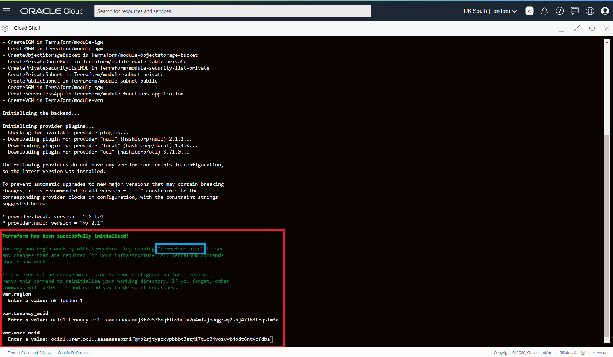

The Terraform deployment will take a few minutes


Finally you will receive some output parameters:

Next two parameters should be included in your serverless app, but review them (in next section) to avoid future connection problems.
* **ATP_client_id** necessary in the serverless functions to access via ORDS to the ATP DB
* **ATP_client_secret** necessary in the serverless functions to access via ORDS to the ATP DB

And next two parameters are important to connect to your OCIR (Oracle Cloud Docker Registry) and push function docker images:
* **Object_Storage_Namespace** that should be the same that you saw (and note maybe) in the Tenancy Details UI.
* **User_OAuth_Token** is your OAUth_token and you will use in the next steps of the Lab

> #### IMPORTANT REMINDER:grey_exclamation::grey_exclamation:: 
> AFTER YOUR Terraform script ends, COPY AUTHTOKEN AND KEEP SAFE you can't get it from OCI again.

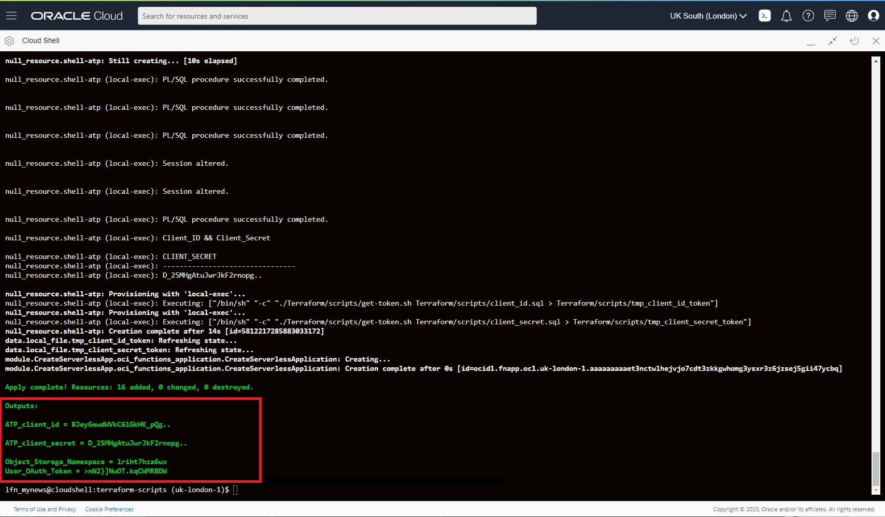

## Review OCI Components
Review your OCI components created with Terraform.

### VCN - Virtual Cloud Network Review
Go to Core Infrastructure -> Networking in the main menu and click in Virtual Cloud Networks.


Check that you are in you HandsOnLab compartment. If the compartment doesn't appear in the dropdown list, please refresh your browser (F5). After refreshing, select the HandsOnLab compartment. You must have a **[functions-vcn]** Virtual Cloud Network.


You can check vnc subnets (2 networks: public and private), route tablets, internet gateway and so. You can click on Security List to check available open ports for example.


### Virtual Developer cloud Machine
After VCN creation, it would be a good time to create your [developer cloud machine](https://github.com/oraclespainpresales/GigisPizzaHOL/blob/master/devmachine-marketplace/devmachine-marketplace.md) if don't have one  with the appropiate software [requisites](https://github.com/oraclespainpresales/GigisPizzaHOL/blob/master/developer-machine/developer-machine.md).

### Object Storage Review
Go to Core Infrastructure -> Object Storage in the main menu and click in Object Storage.


Check your campartment name [HandsOnLab] and review your new bucket.

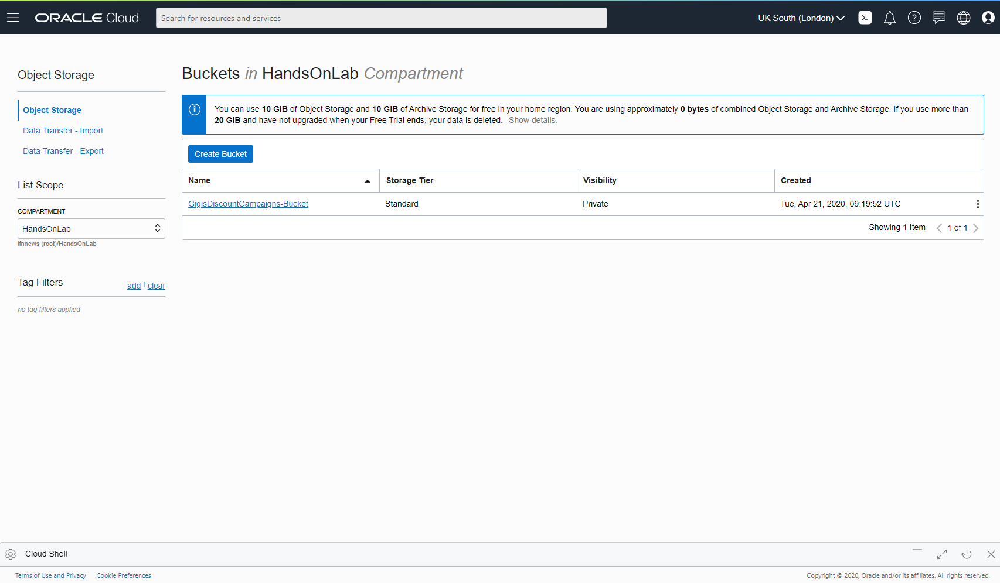

### ATP - Autonomous Database Review
Go to main menu -> Autonomous Transaction Processing.

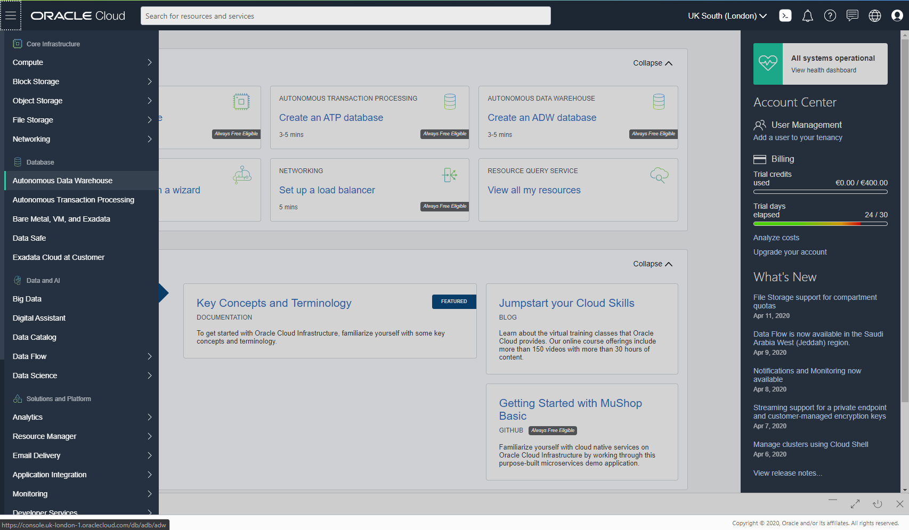

Check your compartment [HandsOnLab]. A new **[DB gigis dicounts]** Always free ATP DB must be created.


> #### Warning NOTE :grey_exclamation::grey_exclamation:: 
> If your Always Free Autonomous Database has **no activity for 7 consecutive days**, the database will be automatically stopped. Your data will be preserved, and you can restart the database to continue using it. If the database **remains stopped for 3 months, it will be reclaimed**.

#### Get ATP Wallet file
To secure the access to an ATPDB from JDBC you will need a wallet file. This file contains the conection strings, profile access and credentials to access to the ATP. Next diagram describe the connection to the ATP from JDBC driver.

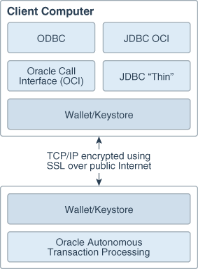

Click DB Connection button to access wallet download and connection Strings menu.


In this menu you can check the connection strings to the ATP. As you can see you could connect with differents service names like TP, TPURGENT, LOW, MEDIUM or HIGH. You can visit the ["Exadata Infrastructure web"](https://docs.oracle.com/en/cloud/paas/atp-cloud/atpug/connect-predefined.html#GUID-9747539B-FD46-44F1-8FF8-F5AC650F15BE) to know about the Service Names meaning. You will use MEDIUM TNS in this demo.


Click Download Wallet button to download to your computer/laptop the ATP **dbwallet.zip** file. You will write a password to download the wallet, please write one [WalletPassw0rd] and note it for future uses. Click Download button to download the wallet zip file.


After wallet file download, click Close button to close the connections menu.

#### ATP Service Console
Next step in your ATP configuration is to access to ATP Service Console clicking in Service Console button.


A new browser tab will appear with ATP Service Console menu. You can see the ATP Overview and Performance.

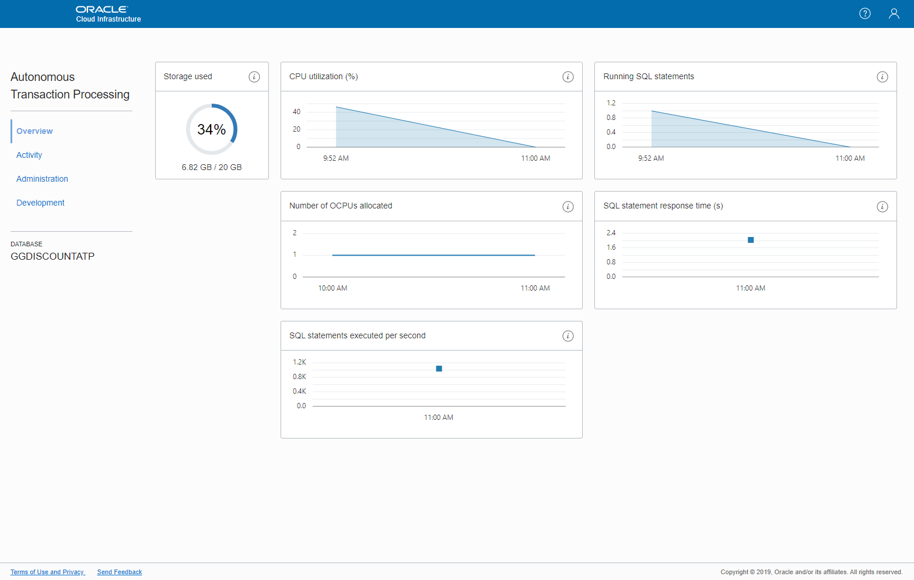

If you click in Activity you will see a real time monitor and monitored SQL dashboard.


Next click Development menu and then click SQL Developer Web


A new browser tab will appear with Username and Password login form to access to ATP via web browser. Write username as ADMIN and your ATP admin password that you wrote in the ATP creation process and click Sign in button.


Now you can write and execute SQL commands in Worksheet tab. Click on Green Play button to run the SQL commands when you want.

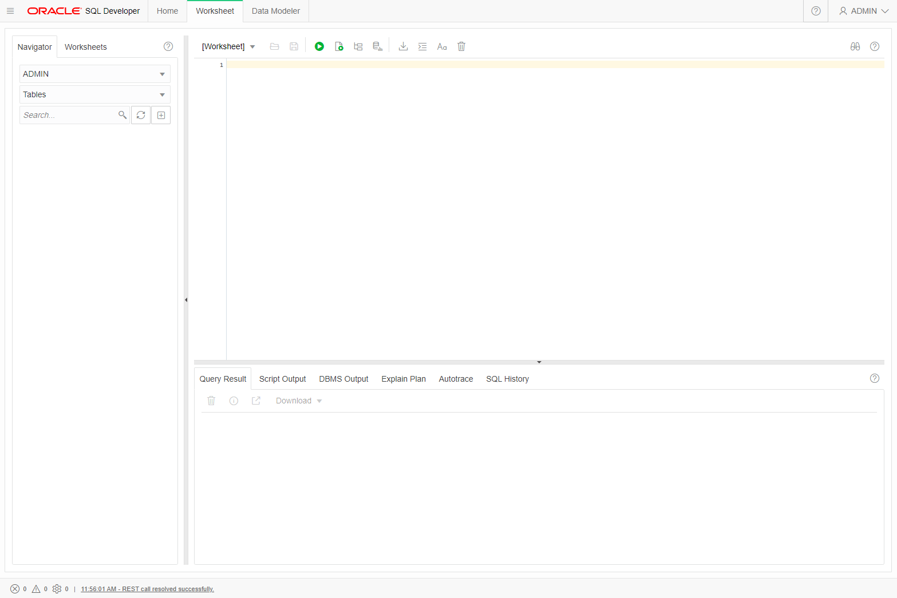

### OCI IAM FaaS Policy Review
Go to main menu Governance & Administration (at the bottom of main menu) and select Identity -> Policies.

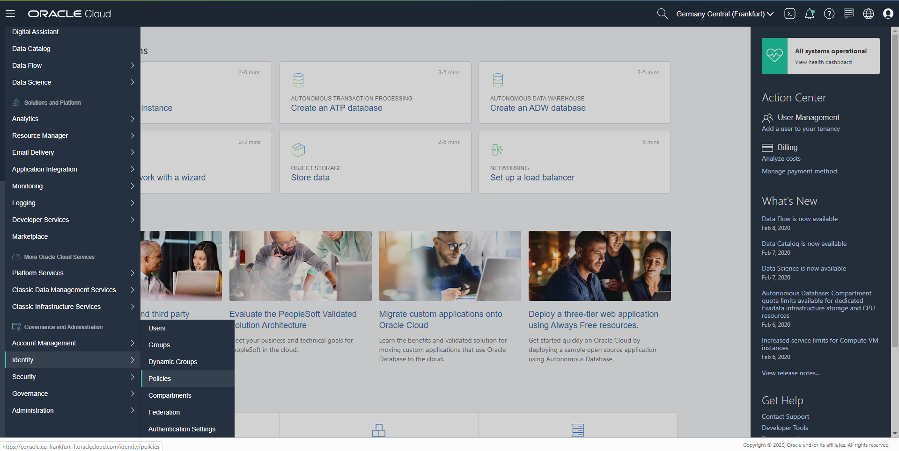

Check that your selected compartment is the **root compartment**. All policies created in parent compartments are inherited to theirs "sons" and as security best practice, you must create important policies always at root compartment level, because only the tenant administrators can change the policies at this compartment level.

Review your new Policy to check the sentence.
```
Allow service FaaS to manage all-resources in tenancy
```


### Oracle FaaS Serverless Application Review
Go to Developer Services in the main menu and select Functions.


Check that your compartment is [HandsOnLab] a new serverless application [gigis-serverless-hol] should be there.

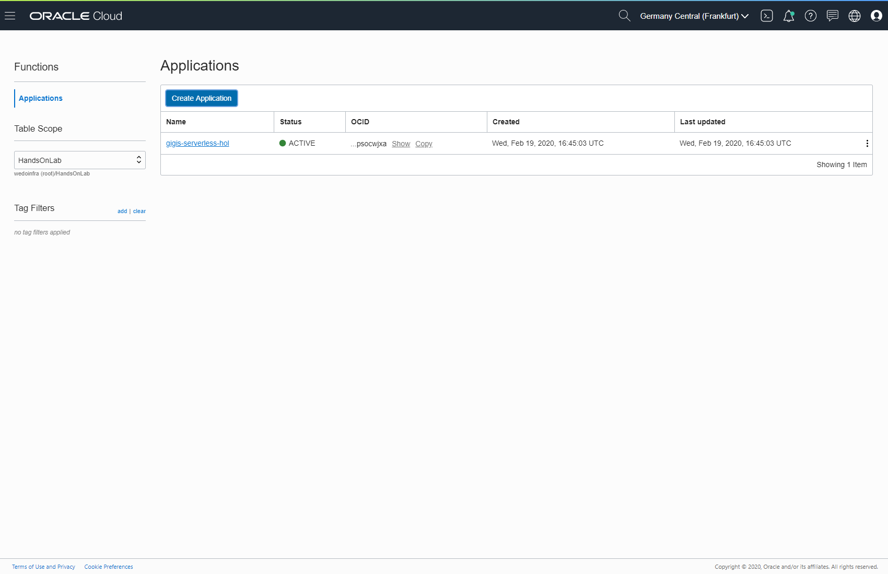

As you can see Functions are empty because you haven't created a serverless function yet. But the serverless application will be composed of 3 serverless functions, that you will create in next sections.


Click Configuration menu to review your serverless app environment variables.


#### Function Environment Variables Review
You must have all next environment variables to setup your serverless application, before functions creation. When you create the serverless functions, they will can access your ATP Database with both ORDS or JDBC methods. **Bold** values would be changed by your own values.

|| Key | Example Value |
| ------------- | ------------- | ------------- |
|01| CLIENT_CREDENTIALS|/function/wallet|N/A|
|02| DB_ORDS_BASE|example: https://**ixcsyvrmtjm8ebr-ggdiscountatp**.adb.**eu-frankfurt-1**.oraclecloudapps.com/ords/|
|03| DB_ORDS_CLIENT_ID|example: **DWxb8cNpjGJaJ415GN8Lqg..**|
|04| DB_ORDS_CLIENT_SECRET|example: **5VHamjpqAcTncEyIVOTdTA..**|
|05| DB_ORDS_SERVICE|atp/campaign|
|06| DB_ORDS_SERVICE_OAUTH|atp/oauth/token|
|07| DB_USER|**MICROSERVICE**|
|08| DB_PASSWORD|**AAZZ__welcomedevops123**|
|09| DB_URL|jdbc:oracle:thin:@|
|10| DB_SERVICE_NAME|**ggdiscountatp_MEDIUM**|
|11| KEYSTORE_PASSWORD |**WalletPassw0rd**|
|12| TRUSTSTORE_PASSWORD |**WalletPassw0rd**|

Please review that **[DB_ORDS_CLIENT_ID]** and **[DB_ORDS_CLIENT_SECRET]** are created and have the same values that you received from Terraform deployment.

Once you have reviewed all OCI components you can continue with the next steps of the lab.

## Functions Logging
If you want to create a function logging to trace your code, you have several methods: create log in an OCI object storage bucket, use a remote syslog server or use the OCI logging service.

If your tenancy has OCI logging service enabled, you can send log traces to OCI logging system and see them after functions execution. To check if your tenancy has the OCI logging service enabled, go to main menu -> Solutions and Platform and Logging.


Optionally and if your tenancy logging service is not enabled yet, you could create a free account in [papertrail](https://papertrailapp.com/) or similar service as syslog remote server, to send log traces from the serverless functions.

Next sections will guide you to create an OCI logging service or a remote syslog server with papertrail, choose one of both methods as your needs.

### OCI Logging Service Configuration
Go to Logging service clicking in the main menu Solutions & Platform -> Logging -> Log Management


A message like "There is no group created in this compartment..." will be showed if you don't have created any Log Group before. Then click Create Log Group button to create a new Log group.


Write a name for the Log Group [FunctionsLogGroup] and a description. Then click Create button.

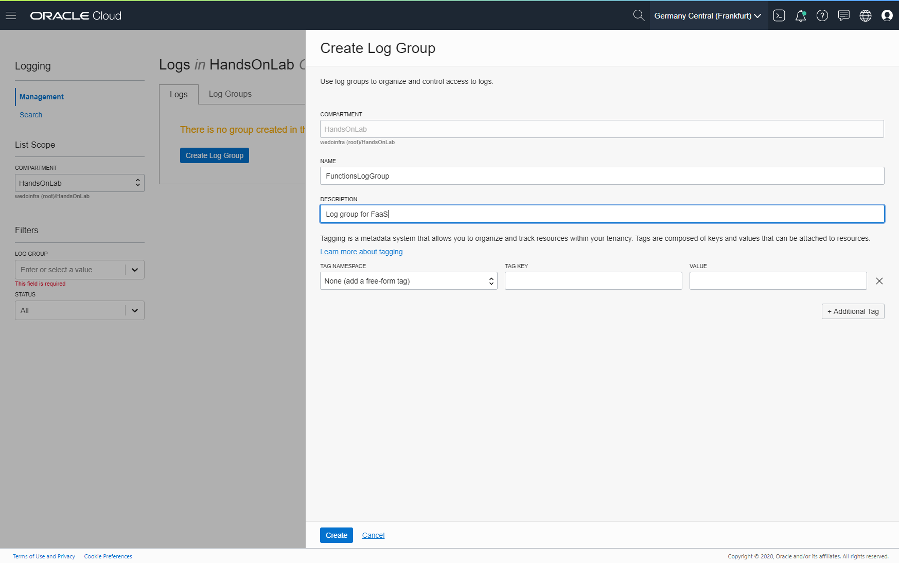

A new empty Logging group should be created. Next click Enable Log button

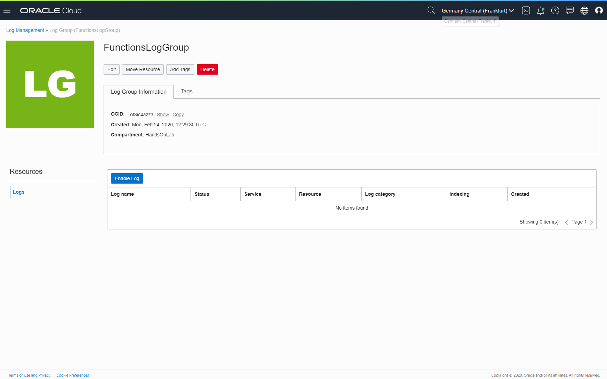

Check your compartment is selected. Follow next steps:
* Select [Functions] in Service dropdown menu.
* Select you serverless app [gigis-serverless-hol] in Resource dropdown menu.
* Select invoke in Log Creation dropdown.
* Write a Log Name [gigis-FaaS-invoke-logging] for this log trace.

Then click Enable Log button


Check that your serverless app change Logs field from none to ObjectStorage. Go Functions -> Applications -> [gigis-serverless-hol] to review that field.


Now you have configured the functions logging and you should see log traces in the logging service when a serverless Function will be invoked.

### Papertrail syslog Configuration
If your tenancy logging service is not enabled yet or you want to use a syslog instead the logging service, you should follow next steps to configure a syslog server for logging serverless functions.

Open a new browser tab and surf the web to www.papertrail.com to create a new account. click Sign Up green button to create your new papertrail account.


Write your name, email and password. Then select a country, check privacy notice and click Start Logging button.


Log into your new account and select Settings -> Account to configure your remote syslog server.


Select Log Destinations and click Create Log Destination button.

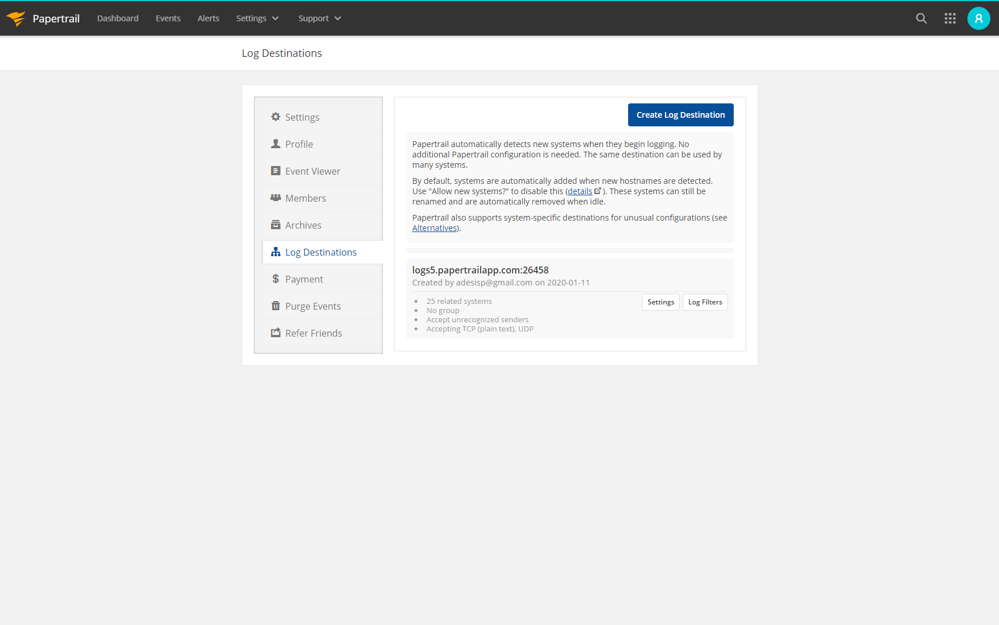

Check Yes, recognize logs from new systems and Accept connections via.. TCP > TLS encryption and UDP > Plain Text. Then click Create button.

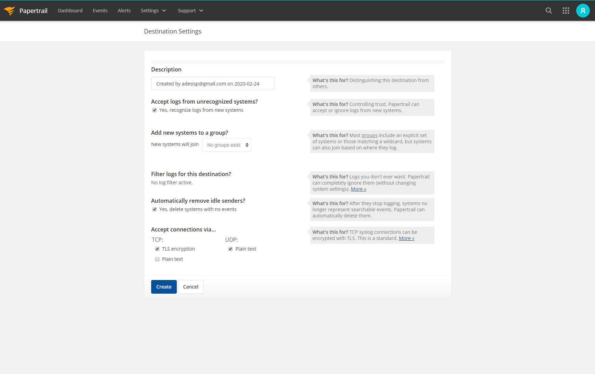

In Log Destinations you should see a new syslog URL like **[log<number>.papertrail.com:<port>]**. Please note this URL to copy it to syslog remote server in OCI Functions menu.
	
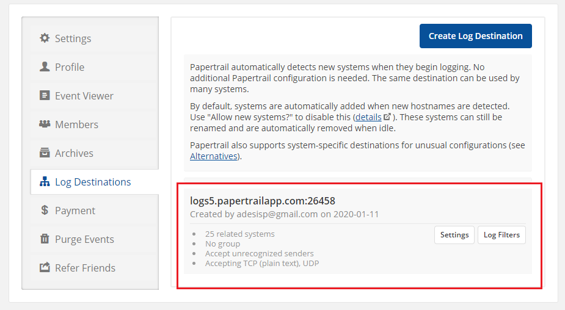

Go to Functions menu and [gigis-serverless-hol] app. Then Click Edit button.

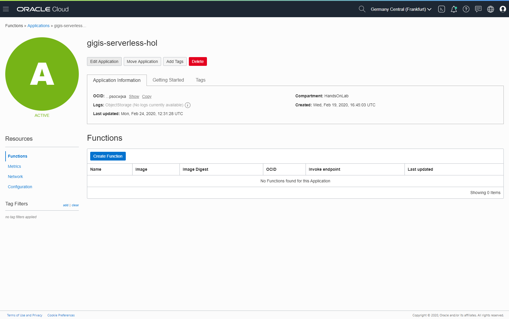

Change Logging Policy from none or Object Storate to SYSLOGURL and copy the papertrail syslog server URL as **[tcp://your-papertrail-log-url]**. Then click Save Changes.

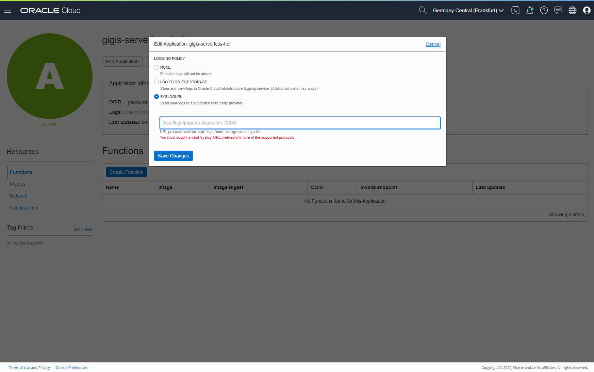

Now you have configured your remote syslog server in papertrail. When a Function is invoked you should see a new logging trace line in papertrail [Events] dashboard. You can open papertrail in a separate tab or window web browser to see your functions logging in almost real-time.

## Serverless Functions Coding
In this section you'll review the discount campaign functions code and you'll copy them to your [development computer](https://github.com/oraclespainpresales/GigisPizzaHOL/blob/master/developer-machine/developer-machine.md) to create the functions in OCI and launch the application. If you don't have a laptop or desktop with the appropiate tools, we recomend you create a [development machine](https://github.com/oraclespainpresales/GigisPizzaHOL/blob/master/devmachine-marketplace/devmachine-marketplace.md) in your compartment.

Check that you have installed and configured next development resources and applications:

- IDE software (Visual code, Eclipse, Jdeveloper ...)
- Java jdk 11 & 13 (to use in your IDE workspaces)
- Docker (to create and push docker images)
- Fn cli (to create FDKs, create the functions and upload them to FaaS in OCI)
- OCI cli installed and configured

Please check that your development computer has internet connection without any limitation like proxies, firewalls and ports blocked to avoid connection problems when you upload or send fn commands to the serverless functions in OCI FaaS.

### Creating the Serverless Functions.
To create your three serverless functions you must configure a fn context in your development machine. We have created the HOL with a recomended linux machine. Please follow the **Getting Started** instructions in your OCI serverless app. 

Go to your serverless app in main menu Developer Services -> Functions.


Select your serverless app [gigis-serverless-hol]


Select Getting Started TAB. 


#### Fn context
Before you create the new 3 functions you must follow steps **from 3 to 5** of Geeting Started guide to create your serverless fn context as the steps are unique for your tenancy (they are set with your appropiate information).


* Create a context for your compartment and select it for use.
```sh
fn create context <YOUR-COMPARTMENT> --provider oracle
fn use context <YOUR-COMPARTMENT>
```
* Update the context with the compartment ID and the Oracle Functions API URL.
```sh
fn update context [YOUR-COMPARTMENT-OCID]
fn update context api-url https://functions.[your-region].oraclecloud.com
```
* Update the context with the location of the OCI Registry you want to use. The [OCIR-REPO] name could be what ever you want and the fn deploy will create the repo if the repo doesn't exists.
```sh
fn update context registry [YOUR-OCIR-REGION].ocir.io/[YOUR-TENANCY-NAMESPACE]/[YOUR-OCIR-REPO]
```

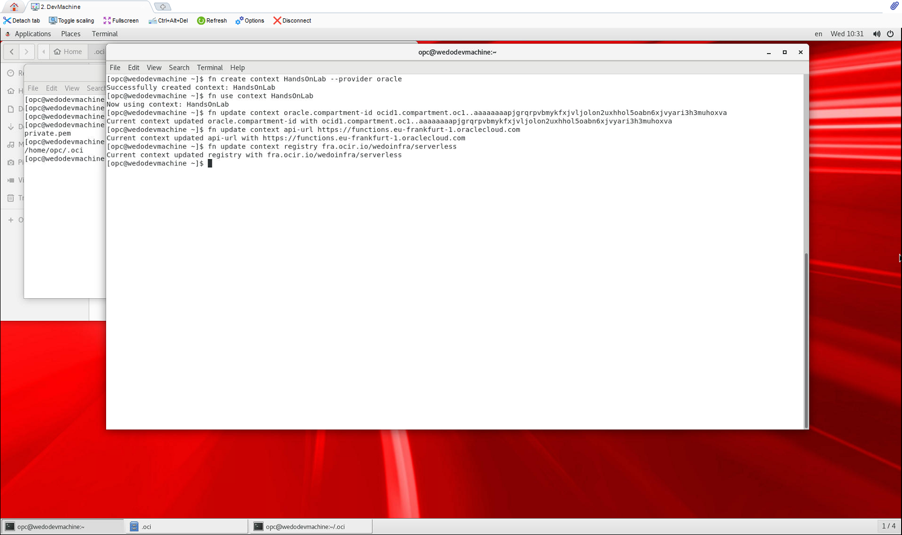

Verify your current used context and OCIR repo - marked with (*):

```sh
fn list context
```


## Create Fn Serverless Functions
Once you create your new fn context, you can continue creating your three serverless functions. For educational purposes you will change the code created with ```fn init``` commands instead of clone them from a git repository.

You could clone the serverless functions from a GIT repository if you needed (developer cloud optional part of the HOL or github), instead of copy and paste the content of the files. You can learn how to clone from the GIT repository in this [section](clone-git project to IDE). 

To create a serverless function you must execute **fn init** command. So you will have to execute that command 3 times, one for each function. Fn commands will be executed in your development machine in $HOME directory or other directory that you create for the lab, for example [holserverless].

Optionally you could create a 4th function to get discounts but using a pool DataSource instead of a direct JDCB connection as you can see in the 3rd function [fn_discount_campaign].

```sh
mkdir holserverless

cd holserverless

fn init --runtime java fn_discount_upload
fn init --runtime java fn_discount_cloud_events
fn init --runtime java fn_discount_campaign
```
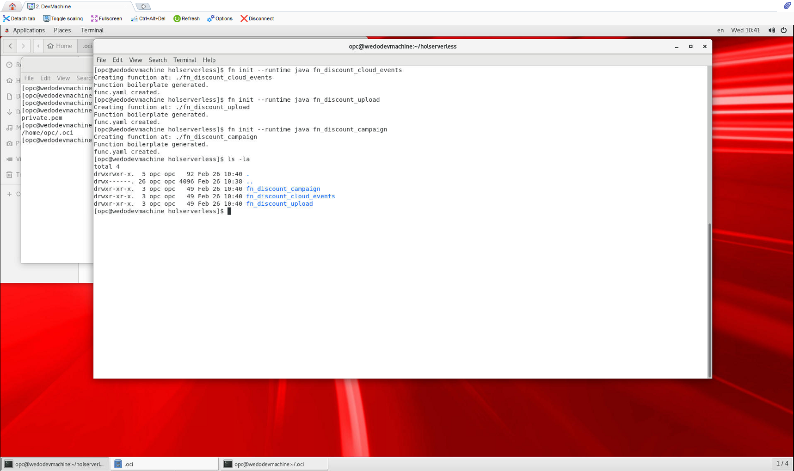

Optional:
```
fn init --runtime java fn_discount_campaign_pool
```
Then you must modify each function with the appropiate code (you can ```CTRL + mouse click``` over the links to open new browser tabs):

1. [fn_discount_upload](https://github.com/oraclespainpresales/GigisPizzaHOL/blob/master/serverless/fn_pizza_discount_upload.md)
2. [fn_discount_cloud_events](https://github.com/oraclespainpresales/GigisPizzaHOL/blob/master/serverless/fn_pizza_discount_cloud_events.md)
3. [fn_discount_campaign](https://github.com/oraclespainpresales/GigisPizzaHOL/blob/master/serverless/fn_pizza_discount_campaign.md)

**[Optional]** [fn_discount_campaign_pool](https://github.com/oraclespainpresales/GigisPizzaHOL/blob/master/serverless/fn_pizza_discount_campaign_pool.md)

**[Optional]** Alternative python code for upload function at [fn_discount_upload_py](https://github.com/oraclespainpresales/GigisPizzaHOL/blob/master/serverless/fn_pizza_discount_upload_py.md)
## Function Testing
Now that you create and configure the entire project, you [could test the serverless app and serverless functions](https://github.com/oraclespainpresales/GigisPizzaHOL/blob/master/serverless/funtion_testing.md).
